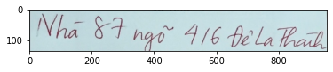
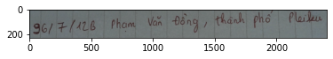
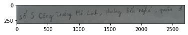
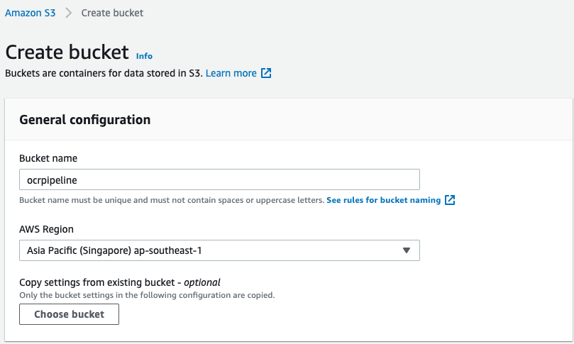
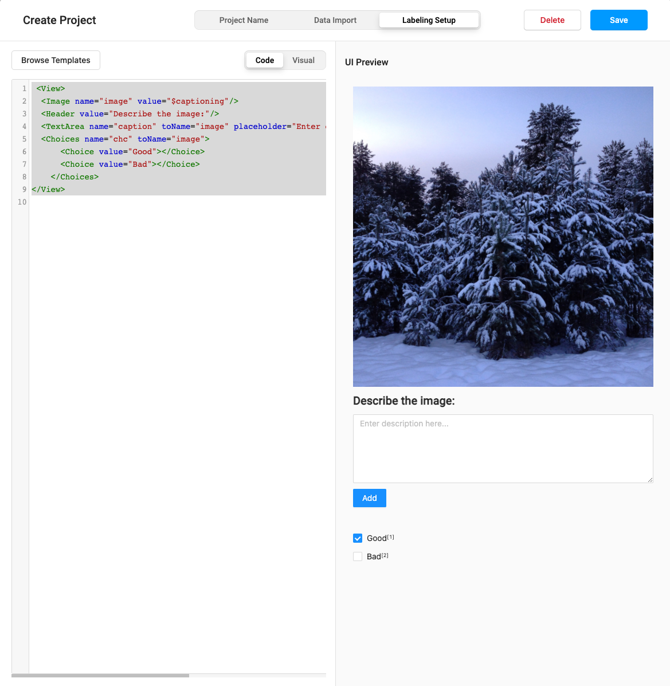
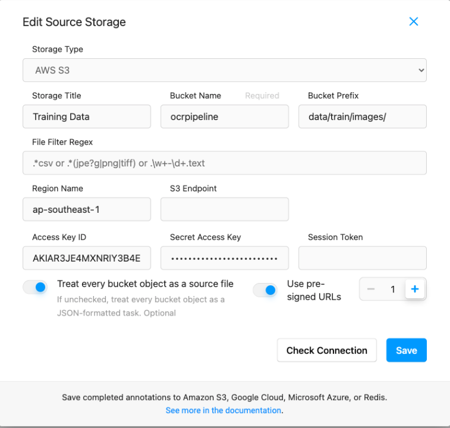
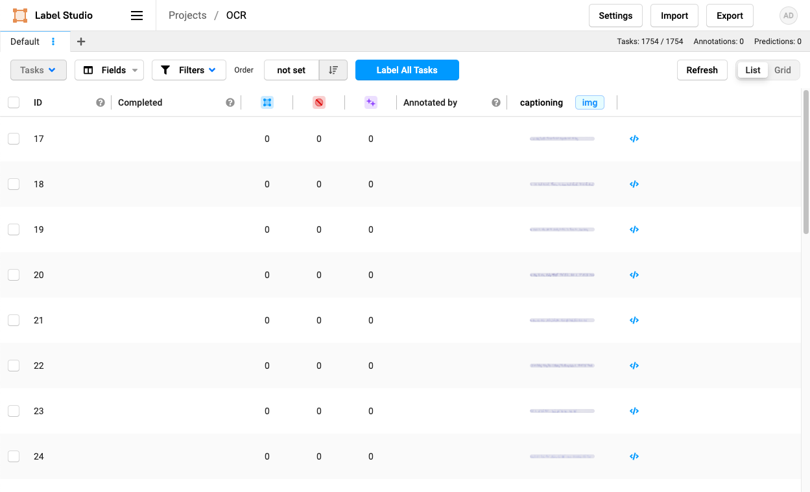
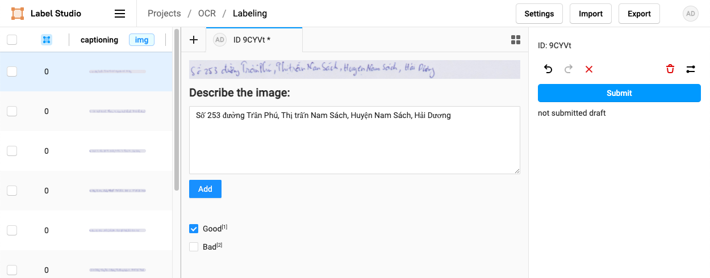

# Data Pipeline
Trong phần này, chúng ta sẽ thực hiện việc lưu trữ và gán nhãn dữ liệu.

## 1. Phân tích dữ liệu
Trước khi giải quyết một bài toán, chúng ta cần phải thực hiện công việc phân tích dữ liệu để đưa ra phương pháp gán nhãn phù hợp và hiệu quả. Bài toán mà chúng ta sẽ cùng nhau giải quyết trong blog này tương đối đơn giản về mặt dữ liệu, với đầu vào là hình ảnh của một dòng chữ viết tay và chúng ta cần trả về kết quả dãy kí tự mà máy đọc được từ hình ảnh đó.

```python
import os
import cv2
from matplotlib import pyplot as plt
```

### Data Sample


```python
DATA_SAMPLE_FOLDER = './Challenge 1_ Handwriting OCR for Vietnamese Address/0825_DataSamples 1'
```


```python
for image_name in os.listdir(DATA_SAMPLE_FOLDER)[:6]:
    if '.json' in image_name:
        continue
    
    image_path = os.path.join(DATA_SAMPLE_FOLDER, image_name)
    image = cv2.imread(image_path)
    plt.imshow(image)
    plt.show()
```


    
> 
    


    
> 
    


    
> 
    


    
> 
    


    
> 
    


### Dataset
Thông thường, khi tiếp cận các bài toán học máy, chúng ta cần phân tích dữ liệu và chia dữ liệu thành các tập huấn luyện (training set), tập đánh giá (validation set) và tập thử nghiệm (testing set). 

Trong bộ dữ liệu mà chúng ta sử dụng ở đây, tập dữ liệu huấn luyện và tập thử nghiệm đã được chia sẵn, vì vậy, chúng ta sẽ chia tập dữ liệu huấn luyện có sẵn thành hai tập: tập dữ liệu huấn luyện và tập đánh giá.


```python
TRAIN_FOLDER = './Challenge 1_ Handwriting OCR for Vietnamese Address/0916_Data Samples 2'
TEST_FOLDER = './Challenge 1_ Handwriting OCR for Vietnamese Address/1015_Private Test'
```


```python
train_image_paths = [os.path.join(TRAIN_FOLDER, image_name) 
                     for image_name in os.listdir(TRAIN_FOLDER) 
                     if '.json' not in image_name]
train_image_paths[:5]
```


>     ['./Challenge 1_ Handwriting OCR for Vietnamese Address/0916_Data Samples 2/0768_samples.png',
>      './Challenge 1_ Handwriting OCR for Vietnamese Address/0916_Data Samples 2/0238_samples.png',
>      './Challenge 1_ Handwriting OCR for Vietnamese Address/0916_Data Samples 2/0898_samples.png',
>      './Challenge 1_ Handwriting OCR for Vietnamese Address/0916_Data Samples 2/0907_samples.png',
>      './Challenge 1_ Handwriting OCR for Vietnamese Address/0916_Data Samples 2/0071_samples.png']


```python
print('Number of training images:', len(train_image_paths))
```

>     Number of training images: 1823


```python
test_image_paths = [os.path.join(TEST_FOLDER, image_name) 
                     for image_name in os.listdir(TEST_FOLDER) 
                     if '.json' not in image_name]
test_image_paths[:5]
```


>     ['./Challenge 1_ Handwriting OCR for Vietnamese Address/1015_Private Test/0232_tests.png',
>      './Challenge 1_ Handwriting OCR for Vietnamese Address/1015_Private Test/0004_tests.png',
>      './Challenge 1_ Handwriting OCR for Vietnamese Address/1015_Private Test/0374_tests.png',
>      './Challenge 1_ Handwriting OCR for Vietnamese Address/1015_Private Test/0142_tests.png',
>      './Challenge 1_ Handwriting OCR for Vietnamese Address/1015_Private Test/0468_tests.png']


```python
print('Number of testing images:', len(test_image_paths))
```

>     Number of testing images: 549


#### Split datasets


```python
NEW_TRAIN_FOLDER = './data/train/images'
NEW_VALIDATION_FOLDER = './data/validation/images'
NEW_TEST_FOLDER = './data/test/images'

for folder in [NEW_TRAIN_FOLDER, NEW_VALIDATION_FOLDER, NEW_TEST_FOLDER]:
    if not os.path.exists(folder):
        os.makedirs(folder, exist_ok=True)
```


```python
import random

validation_image_paths = random.choices(train_image_paths, k=int(0.2*len(train_image_paths)))
train_image_paths = list(set(train_image_paths).difference(set(validation_image_paths)))
```


```python
print('Number of training images:', len(train_image_paths))
print('Number of validation images:', len(validation_image_paths))
print('Number of testing images:', len(test_image_paths))
```

>     Number of training images: 1497
>     Number of validation images: 364
>     Number of testing images: 549


```python
import shutil

def copy_images_to_folder(image_paths, to_folder):
    for path in image_paths:
        shutil.copy2(path, to_folder)
        
copy_images_to_folder(train_image_paths, NEW_TRAIN_FOLDER)
copy_images_to_folder(validation_image_paths, NEW_VALIDATION_FOLDER)
copy_images_to_folder(test_image_paths, NEW_TEST_FOLDER)
```

## 2, Lưu trữ dữ liệu
Để đảm bảo dữ liệu được an toàn và bảo mật, cũng như có khả năng cập nhật dữ liệu mới, chúng ta sẽ sử dụng AWS S3 để lưu trữ. AWS S3 cung cấp CLI interface, SDK để chúng ta có thể tương tác một cách dễ dàng hơn với dữ liệu của mình.

### Tạo S3 bucket
Để tạo một S3 bucket, chúng ta cần có một tài khoản AWS, sau đó truy cập vào [AWS Console](https://console.aws.amazon.com/) rồi chọn [S3 Service](https://s3.console.aws.amazon.com/s3/home?region=ap-southeast-1#) -> [**Create bucket**](https://s3.console.aws.amazon.com/s3/bucket/create?region=ap-southeast-1)

Ở đây, chúng ta nhập các thông tin cần thiết: `Bucket name`, `AWS Region` sau đó chọn `Create bucket` để tạo bucket. Ví dụ ở đây chúng ta sẽ đặt tên cho bucket là `ocrpipeline` và đặt tại Singapore.



### AWS Credentials
Để có thể tương tác với AWS S3 bằng CLI, chúng ta cần phải có AWS Credentials. Chúng ta có thể tạo AWS Credentials tại [Identity and Access Management (IAM)](https://console.aws.amazon.com/iam/home?region=ap-southeast-1#/security_credentials), chọn mục *Access keys (access key ID and secret access key)*, sau đó tiến hành tạo *Access Key* bằng cách chọn *Create New Access Key*. Bạn hãy lưu hai key này vào nơi an toàn, chúng ta sẽ không thể nhìn thấy `Secret Access Key` khi đóng cửa sổ này.

Sau khi tạo *Access Key*, chúng ta cần cài đặt chúng lên máy của mình bằng cách sử dụng `AWS CLI`. Trước hết chúng ta cần phải cài đặt AWS CLI bằng Terminal:

```
pip install awscli
```

Sau đó thực hiện cài đặt các key mà chúng ta vừa tạo ra bằng cách sử dụng câu lệnh:
```
aws configure
```
Nhập các thông tin cần thiết vào
```
> AWS Access Key ID [****************4ZHS]:
> AWS Secret Access Key [****************DNb9]: 
> Default region name [ap-southeast-1]: 
> Default output format [json]: 
```

Chúng ta thử nghiệm việc thêm access keys thành công bằng câu lệnh sau trong Terminal:
```
aws s3 ls
```

Kết quả thu được là danh sách các bucket hiện tại mà chúng ta đang có:
```
202x-xx-xx xx:xx:xx ocrpipeline
```

### Tải dữ liệu lên AWS S3
Chúng ta tải dữ liệu lên S3 bucket như sau:
```
aws s3 sync ./data s3://ocrpipeline/data/
```

## Gán nhãn dữ liệu
Trong blog này, chúng ta sẽ sử dụng [Label Studio](https://github.com/heartexlabs/label-studio) để gán nhãn. Label Studio là một phần mềm gán nhãn mã nguồn mở, hỗ trợ nhiều loại dữ liệu như hình ảnh, âm thanh, video hay dữ liệu chuỗi thời gian. Ngoài ra chúng ta cũng có thể tích hợp các API để phục vụ cho việc prelabeling, giúp quá trình gán nhãn được hoàn thành nhanh hơn. Chúng ta sẽ thực hiện việc tích hợp API này ở phần sau của blog. Các bạn có thể tìm hiểu thêm về các tính năng của Label Studio ở đây: https://github.com/heartexlabs/label-studio

(Ngoài ra, nếu chúng ta cần phải label một số lượng lớn dữ liệu, chúng ta có thể thuê các bên cung cấp dịch vụ gán nhãn dữ liệu như [Annoit](https://annoit.com), giúp chúng ta có được dữ liệu nhanh hơn và số lượng lớn hơn phục vụ cho bài toán của mình)

Để cài đặt Label Studio, chúng ta thực hiện câu lệnh sau trên Terminal: 
```
pip install label-studio
```

Và khởi tạo Label Studio như sau:
```
label-studio
```

Sau khi khởi tạo Label Studio, chúng ta truy cập vào đường dẫn mặc định khi Label Studio khởi chạy: [http://localhost:8080](http://localhost:8080). Tiếp theo chúng ta cần đăng kí tài khoản để thực hiện việc gán nhãn dữ liệu.

Việc tiếp theo chúng ta cần làm là tạo một dự án mới và cài đặt `labeling interface` cho dự án. Chọn `Create` ở góc trên bên phải trang web và nhập các thông tin như tên dự án và mô tả của dự án. Sau đó chuyển qua mục `Labeling Setup` để cài đặt `labeling interface` cho dự án. Với bài toán này, chúng ta có thể chọn template là `Optical Character Recognition` hoặc `Image Captioning`. Trong template `Optical Character Recognition`, chúng ta có thể đánh `bounding box` cho từng dòng chữ, nhưng do dữ liệu của chúng ta đã được cắt sẵn ra từng dòng, vì vậy chúng ta có thể lựa chọn template `Image Captioning` để gán nhãn cho bài toán của mình. Ngoài ra, chúng ta cũng có thể sửa đổi `labeling interface` tuỳ ý phụ thuộc vào dữ liệu của mình, bằng cách nhấn vào mục `Code/Visual`. Ở đây, mình sẽ thêm một thuộc tính mới để xác định chất lượng của bức ảnh có tốt hay không bằng cách thêm vào mục `Code` như sau:
```javascript
<View>
  <Image name="image" value="$captioning"/>
  <Header value="Describe the image:"/>
  <TextArea name="caption" toName="image" placeholder="Enter description here..." rows="5" maxSubmissions="1"/>
  <Choices name="chc" toName="image">
      <Choice value="Good"></Choice>
      <Choice value="Bad"></Choice>
    </Choices>
</View>
```

Kết quả thu được như sau:


Nhấn `Save` để lưu giao diện gán nhãn. Tiếp theo chúng ta cần tải dữ liệu lên Label Studio để thực hiện việc gán nhãn. Ngoài việc có thể tải lên dữ liệu trực tiếp từ máy của mình, chúng ta có thể tải dữ liệu từ đám mây (ở đây) chúng ta sử dụng AWS S3, để thực hiện việc này, chúng ta chọn `Settings` -> `Cloud Storage`. Ở đây chúng ta có hai mục:
- `Source Cloud Storage`: dùng để tải dữ liệu từ đám mây lên Label Studio
- `Target Cloud Storage`: dùng để lưu nhãn của dữ liệu sau khi thực hiện việc gán nhãn

Chọn `Add Source Storage` để thêm dữ liệu từ AWS S3, nhập các thông tin cần thiết:
- `Storage Title`: Training Data
- `Bucket Name`: ocrpipeline
- `Bucket Prefix`: data/train/images/
- `Access Key ID` và `Secret Access Key`
- Chọn `Treat every bucket object as a source file` để có thể tải ảnh lên



Sau đó chọn `Add Storage` và chọn `Sync Storage` để cập nhật dữ liệu. Đợi một lúc để dữ liệu có thể được cập nhật sau đó trở về màn hình chính, chúng ta có thể thấy danh sách hình ảnh đã được cập nhật như hình dưới: 



Chọn hình ảnh và chúng ta có thể bắt đầu thực hiện việc gán nhãn dữ liệu.



Chọn submit để hoàn thành việc gán nhãn và chuyển qua bước tiếp theo.

## Tổng kết
Trong phần này, chúng ta đã cùng nhau phân tích dữ liệu của dự án, tải dữ liệu lên đám mây (AWS S3) và thực hiện việc gán nhãn trên dữ liệu này. Trong phần tiếp theo chúng ta sẽ thực hiện việc huấn luyện mô hình học máy trên dữ liệu được gán nhãn và thực hiện tối ưu mô hình.

[Bài tiếp theo: Huấn luyện mô hình học máy](../training/index.md)

<script src="https://utteranc.es/client.js"
        repo="thanhhau097/mlpipeline"
        issue-term="pathname"
        label="Comment"
        theme="github-light"
        crossorigin="anonymous"
        async>
</script>