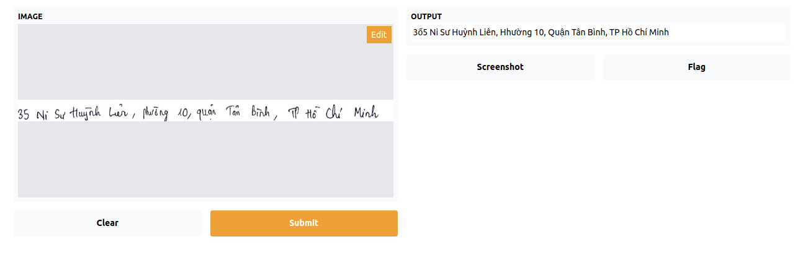

# Triển khai mô hình học máy

Trong các phần trước, chúng ta đã thực hiện việc huấn luyện mô hình và lưu trữ mô hình. Sau khi huấn luyện mô hình, chúng ta cần triển khai mô hình bằng cách áp dụng vào một ứng dụng web hoặc mobile, hoặc chúng ta có thể trả về kết quả thông qua API. Trong phần này, chúng ta sẽ sử dụng công cụ Gradio để xây dựng ứng dụng web và sử dụng Flask để xây dựng API.

## Ứng dụng web
Gradio là thư viện giúp chúng ta có thể tạo một ứng dụng web đơn giản để demo cho mô hình học máy của mình chỉ với một số dòng code. Ngoài ra, Gradio còn cho phép chúng ta sửa đổi giao diện của ứng dụng tùy theo đầu vào và đầu ra của mô hình học máy. Các bạn có thể tìm hiểu têm về Gradio ở đây: https://gradio.app/

Đầu tiên chúng ta cần cài đặt thư viện Gradio:
```
pip install gradio
```

Với bài toán của chúng ta, đầu vào là ảnh và trả về kết quả là chuỗi kí tự, vì vậy ta khởi tạo giao diện như sau:

```python
import gradio

# load the best model
model.load_state_dict(torch.load('best_model.pth'))
model = model.to(device)
interface = gradio.Interface(predict, "image", "text")

interface.launch()
```

Truy cập vào đường dẫn đến ứng dụng web [http://127.0.0.1:7860/](http://127.0.0.1:7862/), và thực hiện tải lên một ảnh để dự đoán và nhấn submit, chúng ta có:



Như vậy chúng ta đã xây dựng được một ứng dụng web đơn giản bằng Gradio để demo cho mô hình học máy của mình.

## Xây dựng API bằng Flask
Trong phần này, chúng ta sẽ sử dụng `Flask` để viết API cho mô hình học máy của mình, các lập trình viên khác có thể sử dụng mô hình học máy của chúng ta bằng cách gọi đến API này để lấy kết quả. 

Quy trình xây dựng một API tương đối đơn giản, chúng ta thực hiện như sau:

```python
import os
from flask import Flask, flash, request, redirect, url_for
from werkzeug.utils import secure_filename

UPLOAD_FOLDER = './data/user_data/'
ALLOWED_EXTENSIONS = set(['txt', 'pdf', 'png', 'jpg', 'jpeg', 'gif'])

app = Flask(__name__)
app.config['UPLOAD_FOLDER'] = UPLOAD_FOLDER
app.secret_key = "super secret key"


@app.route("/predict", methods=['POST'])
def predict_flask():
    if request.method == 'POST':
        # check if the post request has the file part
        if 'file' not in request.files:
            flash('No file part')
            return redirect(request.url)
        file = request.files['file']
        # if user does not select file, browser also
        # submit a empty part without filename
        if file.filename == '':
            flash('No selected file')
            return redirect(request.url)
        if file:
            print('found file')
            filename = secure_filename(file.filename)
            filepath = os.path.join(app.config['UPLOAD_FOLDER'], filename)
            file.save(filepath)
            
            image = cv2.imread(filepath)
            output = predict(image)
            return output

```

Để thử nghiệm API, chúng ta thực hiện câu lệnh sau trong Terminal:
```
curl -i -X POST "http://0.0.0.0:5000/predict" -F file=@<filepath>
```

trong đó `filepath là đường dẫn đến dữ liệu `


Một công việc cần thiết chúng ta cần làm là lưu trữ dữ liệu mà người dùng tải lên  nhằm mục đích phân tích độ chính xác của mô hình trên dữ liệu thật và cải thiện mô hình sau này. Để lưu trực tiếp lên AWS S3 thay vì lưu vào thư mục ở máy cá nhân, chúng ta cần sử dụng thư viện `boto3`. Hàm sử dụng để ubload lên `AWS S3` như sau:
```python
import logging
import boto3
from botocore.exceptions import ClientError


def upload_file_to_s3(file_name, bucket, object_name=None):
    """Upload a file to an S3 bucket

    :param file_name: File to upload
    :param bucket: Bucket to upload to
    :param object_name: S3 object name. If not specified then file_name is used
    :return: True if file was uploaded, else False
    """

    # If S3 object_name was not specified, use file_name
    if object_name is None:
        object_name = file_name

    # Upload the file
    s3_client = boto3.client('s3')
    try:
        response = s3_client.upload_file(file_name, bucket, object_name)
    except ClientError as e:
        logging.error(e)
        return False
    return True
```

Để có thể upload hình ảnh mà người dùng tải lên `Gradio` hay gọi API, chúng ta sẽ sửa hàm `predict` thành như sau:
```python
import uuid


def predict(image):
    # upload image to aws s3
    filename = str(uuid.uuid4()) + '.png'
    cv2.imwrite(filename, image)
    upload_file_to_s3(filename, bucket='ocrpipeline', 'data/user_data/images')

    model.eval()
    batch = [{'image': image, 'label': [1]}]
    images = collate_wrapper(batch)[0]

    images = images.to(device)

    outputs = model(images)
    outputs = outputs.permute(1, 0, 2)
    output = outputs[0]

    out_best = list(torch.argmax(output, -1))  # [2:]
    out_best = [k for k, g in itertools.groupby(out_best)]
    pred_text = get_label_from_indices(out_best)

    return pred_text
```

Như vậy mỗi lần người dùng muốn tải lên một ảnh để lấy chuỗi kí tự, chúng ta có thể lưu trữ hình ảnh mà người dùng tải lên để thuận tiện cho việc phân tích và cải thiện mô hình. Ngoài ra, chúng ta cũng nên lưu lại dự đoán của mô hình để có thể đánh giá được độ chính xác của mô hình trên dữ liệu thật mà người dùng tải lên. Coi như đó là một bài tập nhỏ dành cho các bạn.

Sau khi sửa hàm `predict`, chúng ta sẽ khởi tạo lại `Gradio Interface` hoặc `Flask API` như đã làm ở bước trước để có thể sử dụng hàm `predict` mới. Chúng ta có thể kiếm tra liệu hình ảnh đã được tải lên AWS S3 hay chưa bằng cách:
```
aws s3 ls s3://ocrpipeline/data/user_data/
```

## Tổng kết 
Trong bài này, chúng ta đã cùng nhau xây dựng một ứng dụng web và API cho mô hình học máy của mình, cũng như lưu trữ dữ liệu của người dùng tải lên để có thể cải thiện mô hình sau này. Trong các bài tiếp theo, chúng ta sẽ mở rộng và nâng cấp API bằng cách sử dụng thư viện Nuclio để có thể đảm bảo ứng dụng luôn hoạt động ổn định với số lượng lớn `request`.

Bài trước: [Huấn luyện mô hình học máy](../training/index.md)

Bài tiếp theo: [Xây dựng hệ thống huấn luyện mô hình bằng Kubeflow](./kubeflow/index.md)

[Về Trang chủ](../index.md)