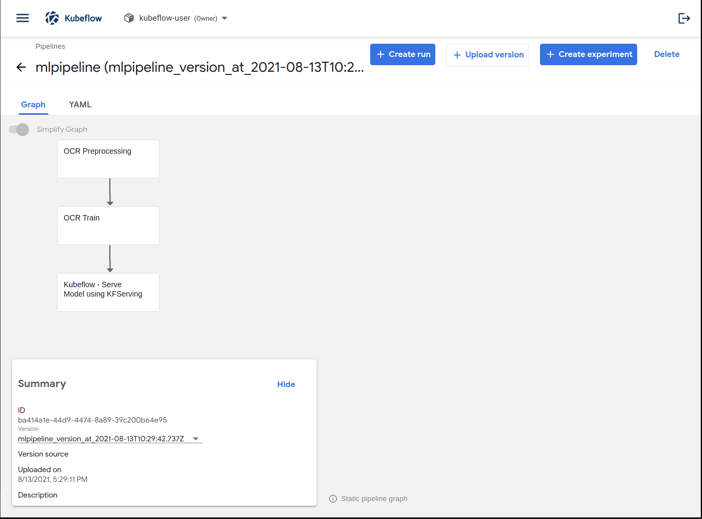

# Xây dựng hệ thống huấn luyện mô hình bằng Kubeflow

Sau khi gán nhãn dữ liệu, huấn luyện mô hình và triển khai mô hình trên giao diện web. Chúng ta có thể nhận thấy việc thực hiện công việc này đang độc lập với nhau và thực hiện một cách thủ công.

Trong phần này, chúng ta sẽ sử dụng Kubeflow để xây dựng một hệ thống để kết nối các bước tiền xử lý dữ liệu, huấn luyện mô hình, triển khai mô hình một cách tự động mỗi khi chúng ta có dữ liệu mới, thay vì phải thực hiện một cách thủ công như chúng ta đã thực hiện ở các bài trước.

Với Kubeflow, chúng ta có thể triển khai một hệ thống học máy trên Kubernetes một cách dễ dàng và có thể nâng cấp và mở rộng tuỳ theo nhu cầu. Các bạn có thể tìm hiểu thêm về Kubeflow ở đây: https://www.kubeflow.org/docs/started/kubeflow-overview/

## Cài đặt Kubeflow
Chúng ta có thể cài đặt Kubeflow trên nhiều môi trường khác nhau, có thể trên máy tính cá nhân, `on-premise` hoặc trên các nền tảng đám mây như `Amazon Web Services (AWS)`, `Microsoft Azure`, `Google Cloud`, etc. 

### Cài đặt Kubeflow bằng MiniKF
Trong phần này, mình sẽ cài đặt Kubeflow trên máy tính cá nhân với [Arrikato MiniKF](https://www.kubeflow.org/docs/distributions/minikf/). Các bạn có thể làm theo hướng dẫn trong đường dẫn này hoặc làm theo các bước dưới đây.

Để cài đặt `MiniKF`, trước hết chúng ta cần cài đặt `Vagrant` và `Virtual Box`. Ở đây mình sử dụng hệ điều hành Ubuntu.

Cài đặt `Vagrant`:
```
curl -fsSL https://apt.releases.hashicorp.com/gpg | sudo apt-key add -
sudo apt-add-repository "deb [arch=amd64] https://apt.releases.hashicorp.com $(lsb_release -cs) main"
sudo apt-get update && sudo apt-get install vagrant
```

Với `Virtual Box`, các bạn tải xuống phiên bản tương ứng với hệ điều hành của mình và tiến hành cài đặt như thông thường theo hướng dẫn ở đây: https://www.virtualbox.org/wiki/Linux_Downloads

Sau khi cài đặt hoàn tất, chúng ta sẽ sử dụng `Vagrant` để cài đặt MiniKF và khởi động MiniKF:

```
vagrant init arrikto/minikf
vagrant up
```

Sau khi cài đặt và khởi động hoàn tất, chúng ta truy cập vào địa chỉ [http://10.10.10.10](http://10.10.10.10) để tiếp tục cài đặt và bắt đàu sử dụng Kubeflow. Giao diện cài đặt trên địa chỉ web như hình dưới.


Chúng ta cài đặt theo giao diện trên `Terminal`, sau khi cài đặt, nhấn `Start MiniKF` và sử dụng tên tài khoản và mật khẩu trên giao diện để đăng nhập vào Kubeflow.

### Cài đặt Kubeflow bằng trên Microk8s
Các bạn có thể làm theo hướng dẫn ở đường dẫn này hoặc các bước sau đây:
1. Cài đặt Microk8s
```
sudo snap install microk8s --classic
```

2. Thêm người dùng hiện tại vào `admin group`
```
sudo usermod -a -G microk8s $USER
sudo chown -f -R $USER ~/.kube
```

sau đó đăng xuất và đăng nhập lại.
3. Kiểm tra xem Microk8s để đảm bảo Microk8s đang chạy
```
microk8s status --wait-ready
```
4. Cài đặt Kubeflow
```
microk8s enable kubeflow
```

Để sử dụng GPU, chúng ta sử dụng lệnh sau:
```
microk8s enable gpu
```

Sau khi cài đặt thành công, chúng ta truy cập vào địa chỉ: 10.64.140.43.nip.io để sử dụng Kubeflow

Đây là giao diện của Kubeflow sau khi đăng nhập:

Kubeflow UI có một số tính năng như:
- `Home`: giao diện chính quản lý các thành phần của Kubeflow
- `Pipelines` dành cho việc quản lý các `pipeline`
- `Notebook Servers` để sử dụng Jupyter notebooks.
- `Katib` cho việc tối ưu siêu tham số.
- `Artifact Store` để quản lý `artifact`.
- `Manage Contributors` để chia sẻ quyền truy cập của người dùng trên các `namespace` trong Kubeflow.

## Xây dựng Kubeflow Pipeline
Trong phần này, chúng ta sẽ xây dựng một Kubeflow pipeline bao gốm các thành phần: tiền xử lý dữ liệu, huấn luyện mô hình, và triển khai mô hình.

### Cấu trúc thư mục 
Để dễ dàng xây dựng các thành phần của Kubeflow, chúng ta sẽ refactor lại code mà chúng ta đã sử dụng ở bước trên trong jupyter notebook.

Cấu trúc của một thư mục để xây dựng Kubeflow pipeline như sau:
```
components
├── pipeline.py
├── preprocess
│   ├── src
│   │  └── main.py
│   ├── Dockerfile
│   ├── build_image.sh
│   └── component.yaml
├── train
│   └── ...
└── _deployment
    └── ...
```

Chúng ta sẽ chia thành ba thành phần nhỏ: `preprocess`, `train`, `deployment`. Trong mỗi thành phần, chúng ta có các thành phần con như sau:
- **Thư mục `src`**: dùng để chứa code cho nhiệm vụ mà chúng ta cần làm: tiền xử lý dữ liệu, huấn luyện mô hình hay triển khai mô hình. Chúng ta sẽ refactor và chuyển code chúng ta đã làm ở các bài trước vào thư mục này.
- `Dockerfile`: dùng để xây dựng `docker image` làm môi trường cho chương trình.
- `build_image.sh`: shell dùng để khởi tạo `docker image` và đẩy chúng lên `docker hub`
- `component.yaml`: định nghĩa nội dung của thành phần

Chúng ta sẽ đi vào chi tiết của từng thành phần trong phần tiếp theo. Chúng ta sẽ kết nối các thành phần này lại với nhau trong tệp `pipeline.py` và xây dựng một `pipeline` như sau:



### Tiền xử lý dữ liệu
Chúng ta sẽ cùng nhau tiến hành xây dựng thành phần đầu tiên đó là tiền xử lý dữ liệu. 

#### Xây dựng mã nguồn
Đầu tiên, chúng ta cần sao chép mã nguồn của thành phần tiền xử lý dữ liệu ở các bài trước và đưa vào tệp `main.py` trong thư mục `src`. Tệp `main.py` có nội dung như sau:

```python
import os
import json
from pathlib import Path

# define the aws key
os.environ["AWS_ACCESS_KEY_ID"] = "**************************"
os.environ["AWS_SECRET_ACCESS_KEY"] = "**************************"

# download data from label studio
print("DOWNLOADING DATA")
import requests

url = "https://***********.ngrok.io/api/projects/1/export"
querystring = {"exportType":"JSON"}
headers = {
    'authorization': "Token ******************************",
}
response = requests.request("GET", url, headers=headers, params=querystring)
    
# split train/val/test/user_data label from this json file
user_data = []
train_data = []
val_data = []
test_data = []
for item in response.json():
    if 's3://ocrpipeline/data/user_data' in item['data']['captioning']:
        user_data.append(item)
    elif 's3://ocrpipeline/data/train' in item['data']['captioning']:
        train_data.append(item)
    elif 's3://ocrpipeline/data/test' in item['data']['captioning']:
        test_data.append(item)
    elif 's3://ocrpipeline/data/validation' in item['data']['captioning']:
        val_data.append(item)

def save_labels(folder, data):
    if not os.path.exists(folder):
        os.makedirs(folder, exist_ok=True)
    label_path = os.path.join(folder, 'label_studio_data.json')
    with open(label_path, 'w') as f:
        json.dump(data, f)

save_labels('./data/train/', train_data)
save_labels('./data/test/', test_data)
save_labels('./data/validation/', val_data)
save_labels('./data/user_data/', user_data)

# preprocess
print("PREPROCESSING DATA")
def convert_label_studio_format_to_ocr_format(label_studio_json_path, output_path):
    with open(label_studio_json_path, 'r') as f:
        data = json.load(f)

    ocr_data = {}

    for item in data:
        image_name = os.path.basename(item['data']['captioning'])

        text = ''
        for value_item in item['annotations'][0]['result']:
            if value_item['from_name'] == 'caption':
                text = value_item['value']['text'][0]
        ocr_data[image_name] = text

    with open(output_path, 'w') as f:
        json.dump(ocr_data, f, indent=4)

    print('Successfully converted ', label_studio_json_path)
convert_label_studio_format_to_ocr_format('./data/train/label_studio_data.json', './data/train/labels.json')
convert_label_studio_format_to_ocr_format('./data/validation/label_studio_data.json', './data/validation/labels.json')
convert_label_studio_format_to_ocr_format('./data/test/label_studio_data.json', './data/test/labels.json')
convert_label_studio_format_to_ocr_format('./data/user_data/label_studio_data.json', './data/user_data/labels.json')

# upload these file to s3
print("UPLOADING DATA")
import logging
import boto3
from botocore.exceptions import ClientError


def upload_file_to_s3(file_name, bucket, object_name=None):
    """Upload a file to an S3 bucket

    :param file_name: File to upload
    :param bucket: Bucket to upload to
    :param object_name: S3 object name. If not specified then file_name is used
    :return: True if file was uploaded, else False
    """

    # If S3 object_name was not specified, use file_name
    if object_name is None:
        object_name = file_name

    # Upload the file
    s3_client = boto3.client('s3')
    try:
        response = s3_client.upload_file(file_name, bucket, object_name)
    except ClientError as e:
        logging.error(e)
        return False
    return True


upload_file_to_s3('data/train/labels.json', bucket='ocrpipeline', object_name='data/train/labels.json')
upload_file_to_s3('data/validation/labels.json', bucket='ocrpipeline', object_name='data/validation/labels.json')
upload_file_to_s3('data/test/labels.json', bucket='ocrpipeline', object_name='data/test/labels.json')
upload_file_to_s3('data/user_data/labels.json', bucket='ocrpipeline', object_name='data/user_data/labels.json')

# write data path to output_path.txt
data_path = 's3://ocrpipeline/data'
Path('/output_path.txt').write_text(data_path)
```

Các bước thực hiện như sau:

0. Khai báo các `aws keys` để có thể tải lên và tải xuống dữ liệu từ `AWS S3`: Trong thực tế, chúng ta không cần khai báo các biến này ở trong mã nguồn của mình, chúng ta sẽ thay thế nó bằng cách cho chúng là biến môi trường trước khi chạy `docker image`. Chúng ta không nên khai báo các `aws keys` trong code vì người khác có thể sử dụng được tài khoản của mình và sẽ ảnh hưởng đến vấn đề bảo mật.
1. Tải dữ liệu đã được gán nhán từ `label studio`: Do chúng ta đang sử dụng Label Studio ở máy cục bộ (local host), vì vậy, để gửi được `request` từ `container` trong Kubeflow, chúng ta cần tìm cách mở (expose) Label Studio API. Một cách đơn giản là chúng ta có thể sử dụng `ngrok`. Để sử dụng `ngrok`, các bạn vào đường dẫn này và làm theo các bước để tải và cài đặt `ngrok`. Do `Label Studio` đang chạy ở cổng 8080, vì vậy chúng ta expose `Label Studio` bằng `ngrok` như sau: 
    ```
    ./ngrok http 8080
    ```

    Chúng ta sẽ có đường đường dẫn mà `ngrok` sinh ra và sử dụng để tải dữ liệu từ Label Studio.

2. Xử lý dữ liệu `label studio` và chuyển về định dạng mới
3. Tải dữ liệu lên `AWS S3`
4. Ghi đường dẫn dữ liệu trên `AWS S3` vào tệp `output_path.txt` để có thể sử dụng trong thành phần kế tiếp.

#### Xây dựng Docker image
Chúng ta sẽ xây dựng Docker image để làm môi trường chạy mã nguồn ở trên như sau:
```dockerfile
FROM python:3.7
COPY ./src /src
```

Ở đây chúng ta sử dụng môi trường `python 3.7` và tiến hành sao chép mã nguồn trong thư mục `src`vào thư mục `/src` của `docker container`.

#### Xây dựng shell build_image.sh
Chúng ta xây dựng shell với nội dung như sau:
```shell
#!/bin/bash

full_image_name=<username>/ocrpreprocess

docker build -t "${full_image_name}" .
docker push "$full_image_name"
```

Chúng ta đặt tên cho `docker image` là `<username>/ocrpreprocess` (bạn có thể thay `<username>` với tên của bạn) và tiến hành xây dựng nó với câu lệnh `docker build`. Sau đó chúng ta sẽ đẩy `docker image` này lên `docker hub`.

Để có thể đẩy `docker image` lên `docker hub`, chúng ta cần có tài khoản tại https://hub.docker.com và đăng nhập docker bằng câu lệnh 
```
docker login
```

Sau khi đăng nhập `docker hub`, chúng ta tiến hành chạy shell để xây dựng docker image như sau:

```
chmod +x build_image.sh
./build_image.sh
```

Như vậy chúng ta đã xây dựng môi trường để thực hiện việc tiền xử lý dữ liệu.

#### Định nghĩa cấu hình của thành phần 
Chúng ta sẽ định nghĩa nội dung của một thành phần của Kubeflow pipeline bằng cách khai báo đầu vào, đầu ra, môi trường chạy và cách chạy trong tệp `component.yaml` như sau:
```yaml
name: OCR Preprocessing
description: Preprocess OCR model

outputs:
  - {name: output_path, type: String, description: 'Output Path'}

implementation:
  container:
    image: thanhhau097/ocrpreprocess
    command: [
      python, /src/main.py,
    ]

    fileOutputs:
      output_path: /output_path.txt # path to s3

```

Ở đây, chúng ta sử dụng các thông tin ở các phần trước để điền vào nội dung của tệp này như tên `docker image`, tệp `main.py` để chạy chương trình,... Ngoài ra, chúng ta sẽ đọc dữ liệu từ tệp `output_path.txt` mà chúng ta đã ghi nội dung đường dẫn đến dữ liệu vào để làm đầu ra cho thành phần tiền xử lý dữ liệu.

### Huấn luyện mô hình
Tương tự với thành phần tiền xử lý dữ liệu, chúng ta cũng sẽ xây dựng các tệp cấu tạo nên thành phần của Kubeflow.

#### Xây dựng mã nguồn
Chúng ta thực hiện refactor mã nguồn mà chúng ta sử dụng ở phần trước vào tệp `main.py` vào thư mục `src`:

```python
def train_model(data_path):
    import os
    from pathlib import Path
    import logging
    import boto3
    from botocore.exceptions import ClientError


    def upload_file_to_s3(file_name, bucket, object_name=None):
        """Upload a file to an S3 bucket

        :param file_name: File to upload
        :param bucket: Bucket to upload to
        :param object_name: S3 object name. If not specified then file_name is used
        :return: True if file was uploaded, else False
        """

        # If S3 object_name was not specified, use file_name
        if object_name is None:
            object_name = file_name

        # Upload the file
        s3_client = boto3.client('s3')
        try:
            response = s3_client.upload_file(file_name, bucket, object_name)
        except ClientError as e:
            logging.error(e)
            return False
        return True


    os.environ["AWS_ACCESS_KEY_ID"] = "*********************"
    os.environ["AWS_SECRET_ACCESS_KEY"] = "*********************"

    CHARACTERS = "aáàạảãăắằẳẵặâấầẩẫậbcdđeéèẹẻẽêếềệểễfghiíìịỉĩjklmnoóòọỏõôốồộổỗơớờợởỡpqrstuúùụủũưứừựửữvxyýỳỷỹỵzwAÁÀẠẢÃĂẮẰẲẴẶÂẤẦẨẪẬBCDĐEÉÈẸẺẼÊẾỀỆỂỄFGHIÍÌỊỈĨJKLMNOÓÒỌỎÕÔỐỒỘỔỖƠỚỜỢỞỠPQRSTUÚÙỤỦŨƯỨỪỰỬỮVXYÝỲỴỶỸZW0123456789 .,-/()'#+:"
    PAD_token = 0  # Used for padding short sentences
    SOS_token = 1  # Start-of-sentence token
    EOS_token = 2  # End-of-sentence token

    CHAR2INDEX = {"PAD": PAD_token, "SOS": SOS_token, "EOS": EOS_token}
    INDEX2CHAR = {PAD_token: "PAD", SOS_token: "SOS", EOS_token: "EOS"}

    for i, c in enumerate(CHARACTERS):
        CHAR2INDEX[c] = i + 3
        INDEX2CHAR[i + 3] = c

    def get_indices_from_label(label):
        indices = []
        for char in label:
    #         if CHAR2INDEX.get(char) is not None:
                indices.append(CHAR2INDEX[char])

        indices.append(EOS_token)
        return indices

    def get_label_from_indices(indices):
        label = ""
        for index in indices:
            if index == EOS_token:
                break
            elif index == PAD_token:
                continue
            else:
                label += INDEX2CHAR[index.item()]

        return label

    from comet_ml import Experiment

    import cv2
    from torch.utils.data import Dataset
    
    # Create an experiment with your api key
    experiment = Experiment(
        api_key="***********************",
        project_name="ocr",
        workspace="<username>",
    )


    class OCRDataset(Dataset):
        def __init__(self, data_dir, label_path, transform=None):
            self.data_dir = data_dir
            self.label_path = label_path
            self.transform = transform
            self.image_paths, self.labels = self.get_image_paths_and_labels(label_path)

        def __len__(self):
            return len(self.image_paths)

        def __getitem__(self, idx):
            img_path = self.get_data_path(self.image_paths[idx])
            image = cv2.imread(img_path)
            label = self.labels[idx]
            label = get_indices_from_label(label)
            sample = {"image": image, "label": label}
            return sample

        def get_data_path(self, path):
            return os.path.join(self.data_dir, path)

        def get_image_paths_and_labels(self, json_path):
            with open(json_path, 'r', encoding='utf-8') as f:
                data = json.load(f)

            image_paths = list(data.keys())
            labels = list(data.values())
            return image_paths, labels
        
        
    import itertools

    def collate_wrapper(batch):
        """
        Labels are already numbers
        :param batch:
        :return:
        """
        images = []
        labels = []
        # TODO: can change height in config
        height = 64
        max_width = 0
        max_label_length = 0

        for sample in batch:
            image = sample['image']
            try:
                image = process_image(image, height=height, channels=image.shape[2])
            except:
                continue

            if image.shape[1] > max_width:
                max_width = image.shape[1]

            label = sample['label']

            if len(label) > max_label_length:
                max_label_length = len(label)

            images.append(image)
            labels.append(label)

        # PAD IMAGES: convert to tensor with size b x c x h x w (from b x h x w x c)
        channels = images[0].shape[2]
        images = process_batch_images(images, height=height, max_width=max_width, channels=channels)
        images = images.transpose((0, 3, 1, 2))
        images = torch.from_numpy(images).float()

        # LABELS
        pad_list = zero_padding(labels)
        mask = binary_matrix(pad_list)
        mask = torch.ByteTensor(mask)
        labels = torch.LongTensor(pad_list)
        return images, labels, mask, max_label_length


    def process_image(image, height=64, channels=3):
        """Converts to self.channels, self.max_height
        # convert channels
        # resize max_height = 64
        """
        shape = image.shape
        # if shape[0] > 64 or shape[0] < 32:  # height
        try:
            image = cv2.resize(image, (int(height/shape[0] * shape[1]), height))
        except:
            return np.zeros([1, 1, channels])
        return image / 255.0


    def process_batch_images(images, height, max_width, channels=3):
        """
        Convert a list of images to a tensor (with padding)
        :param images: list of numpy array images
        :param height: desired height
        :param max_width: max width of all images
        :param channels: number of image channels
        :return: a tensor representing images
        """
        output = np.ones([len(images), height, max_width, channels])
        for i, image in enumerate(images):
            final_img = image
            shape = image.shape
            output[i, :shape[0], :shape[1], :] = final_img

        return output


    def zero_padding(l, fillvalue=PAD_token):
        """
        Pad value PAD token to l
        :param l: list of sequences need padding
        :param fillvalue: padded value
        :return:
        """
        return list(itertools.zip_longest(*l, fillvalue=fillvalue))


    def binary_matrix(l, value=PAD_token):
        m = []
        for i, seq in enumerate(l):
            m.append([])
            for token in seq:
                if token == value:
                    m[i].append(0)
                else:
                    m[i].append(1)
        return m

    import torch.nn as nn
    import torch.nn.functional as F


    class VGG_FeatureExtractor(nn.Module):
        """ FeatureExtractor of CRNN (https://arxiv.org/pdf/1507.05717.pdf) """

        def __init__(self, input_channel, output_channel=512):
            super(VGG_FeatureExtractor, self).__init__()
            self.output_channel = [int(output_channel / 8), int(output_channel / 4),
                                    int(output_channel / 2), output_channel]  # [64, 128, 256, 512]
            self.ConvNet = nn.Sequential(
                nn.Conv2d(input_channel, self.output_channel[0], 3, 1, 1), nn.ReLU(True),
                nn.MaxPool2d(2, 2),  # 64x16x50
                nn.Conv2d(self.output_channel[0], self.output_channel[1], 3, 1, 1), nn.ReLU(True),
                nn.MaxPool2d(2, 2),  # 128x8x25
                nn.Conv2d(self.output_channel[1], self.output_channel[2], 3, 1, 1), nn.ReLU(True),  # 256x8x25
                nn.Conv2d(self.output_channel[2], self.output_channel[2], 3, 1, 1), nn.ReLU(True),
                nn.MaxPool2d((2, 1), (2, 1)),  # 256x4x25
                nn.Conv2d(self.output_channel[2], self.output_channel[3], 3, 1, 1, bias=False),
                nn.BatchNorm2d(self.output_channel[3]), nn.ReLU(True),  # 512x4x25
                nn.Conv2d(self.output_channel[3], self.output_channel[3], 3, 1, 1, bias=False),
                nn.BatchNorm2d(self.output_channel[3]), nn.ReLU(True),
                nn.MaxPool2d((2, 1), (2, 1)),  # 512x2x25
                nn.Conv2d(self.output_channel[3], self.output_channel[3], 2, 1, 0), nn.ReLU(True))  # 512x1x24

        def forward(self, input):
            return self.ConvNet(input)
        

    class BidirectionalGRU(nn.Module):
        def __init__(self, input_size, hidden_size, output_size):
            super(BidirectionalGRU, self).__init__()

            self.rnn = nn.GRU(input_size, hidden_size, bidirectional=True)
            self.embedding = nn.Linear(hidden_size * 2, output_size)

        def forward(self, x):
            recurrent, hidden = self.rnn(x)
            T, b, h = recurrent.size()
            t_rec = recurrent.view(T * b, h)

            output = self.embedding(t_rec)  # [T * b, nOut]
            output = output.view(T, b, -1)

            return output, hidden

    class CTCModel(nn.Module):
        def __init__(self, inner_dim=512, num_chars=65):
            super().__init__()
            self.encoder = VGG_FeatureExtractor(3, inner_dim)
            self.AdaptiveAvgPool = nn.AdaptiveAvgPool2d((None, 1))
            self.rnn_encoder = BidirectionalGRU(inner_dim, 256, 256)
            self.num_chars = num_chars
            self.decoder = nn.Linear(256, self.num_chars)

        def forward(self, x, labels=None, max_label_length=None, device=None, training=True):
            # ---------------- CNN ENCODER --------------
            x = self.encoder(x)
            # print('After CNN:', x.size())

            # ---------------- CNN TO RNN ----------------
            x = x.permute(3, 0, 1, 2)  # from B x C x H x W -> W x B x C x H
            x = self.AdaptiveAvgPool(x)
            size = x.size()
            x = x.reshape(size[0], size[1], size[2] * size[3])

            # ----------------- RNN ENCODER ---------------
            encoder_outputs, last_hidden = self.rnn_encoder(x)
            # print('After RNN', x.size())

            # --------------- CTC DECODER -------------------
            # batch_size = encoder_outputs.size()[1]
            outputs = self.decoder(encoder_outputs)

            return outputs
        
    import torch
    import torch.nn.functional as F
    from torch.nn import CTCLoss, CrossEntropyLoss

    def ctc_loss(outputs, targets, mask):
        USE_CUDA = torch.cuda.is_available()
        device = torch.device("cuda:0" if USE_CUDA else "cpu")
        target_lengths = torch.sum(mask, dim=0).to(device)
        # We need to change targets, PAD_token = 0 = blank
        # EOS token -> PAD_token
        targets[targets == EOS_token] = PAD_token
        outputs = outputs.log_softmax(2)
        input_lengths = outputs.size()[0] * torch.ones(outputs.size()[1], dtype=torch.int)
        loss_fn = CTCLoss(blank=PAD_token, zero_infinity=True)
        targets = targets.transpose(1, 0)
        # target_lengths have EOS token, we need minus one
        target_lengths = target_lengths - 1
        targets = targets[:, :-1]
        # print(input_lengths, target_lengths)
        torch.backends.cudnn.enabled = False
        # TODO: NAN when target_length > input_length, we can increase size or use zero infinity
        loss = loss_fn(outputs, targets, input_lengths, target_lengths)
        torch.backends.cudnn.enabled = True

        return loss, loss.item()

    import difflib

    def calculate_ac(str1, str2):
        """Calculate accuracy by char of 2 string"""

        total_letters = len(str1)
        ocr_letters = len(str2)
        if total_letters == 0 and ocr_letters == 0:
            acc_by_char = 1.0
            return acc_by_char
        diff = difflib.SequenceMatcher(None, str1, str2)
        correct_letters = 0
        for block in diff.get_matching_blocks():
            correct_letters = correct_letters + block[2]
        if ocr_letters == 0:
            acc_by_char = 0
        elif correct_letters == 0:
            acc_by_char = 0
        else:
            acc_1 = correct_letters / total_letters
            acc_2 = correct_letters / ocr_letters
            acc_by_char = 2 * (acc_1 * acc_2) / (acc_1 + acc_2)

        return float(acc_by_char)

    def accuracy_ctc(outputs, targets):
        outputs = outputs.permute(1, 0, 2)
        targets = targets.transpose(1, 0)

        total_acc_by_char = 0
        total_acc_by_field = 0

        for output, target in zip(outputs, targets):
            out_best = list(torch.argmax(output, -1))  # [2:]
            out_best = [k for k, g in itertools.groupby(out_best)]
            pred_text = get_label_from_indices(out_best)
            target_text = get_label_from_indices(target)

            # print('predict:', pred_text, 'target:', target_text)

            acc_by_char = calculate_ac(pred_text, target_text)
            total_acc_by_char += acc_by_char

            if pred_text == target_text:
                total_acc_by_field += 1

        return np.array([total_acc_by_char / targets.size()[0], total_acc_by_field / targets.size()[0]])

    from torch.utils.data import DataLoader

    def train_epoch(epoch):
        model.train()
        total_loss = 0
        total_metrics = np.zeros(2)
        for batch_idx, (images, labels, mask, max_label_length) in enumerate(train_dataloader):
            images, labels, mask = images.to(device), labels.to(device), mask.to(device)

            optimizer.zero_grad()
            output = model(images, labels, max_label_length, device)

            loss, print_loss = loss_fn(output, labels, mask)
            loss.backward()
            optimizer.step()

            total_loss += print_loss  # loss.item()
            total_metrics += metric_fn(output, labels)

            if batch_idx == len(train_dataloader):
                break

        log = {
            'loss': total_loss / len(train_dataloader),
            'metrics': (total_metrics / len(train_dataloader)).tolist()
        }

        return log

    def val_epoch():
        # when evaluating, we don't use teacher forcing
        model.eval()
        total_val_loss = 0
        # total_val_metrics = np.zeros(len(self.metrics))
        total_val_metrics = np.zeros(2)
        with torch.no_grad():
            # print("Length of validation:", len(self.valid_data_loader))
            for batch_idx, (images, labels, mask, max_label_length) in enumerate(val_dataloader):
                images, labels, mask = images.to(device), labels.to(device), mask.to(device)
                images, labels, mask = images.to(device), labels.to(device), mask.to(device)

                output = model(images, labels, max_label_length, device, training=False)
                _, print_loss = loss_fn(output, labels, mask)  # Attention:
                # loss = self.loss(output, labels, mask)
                # print_loss = loss.item()

                total_val_loss += print_loss
                total_val_metrics += metric_fn(output, labels)

        return_value = {
            'loss': total_val_loss / len(val_dataloader),
            'metrics': (total_val_metrics / len(val_dataloader)).tolist()
        }

        return return_value

    def train():
        best_val_loss = np.inf
        for epoch in range(N_EPOCHS):
            print("Epoch", epoch + 1)
            train_log = train_epoch(epoch)
            print("Training log:", train_log)
            train_loss = train_log['loss']
            train_acc_by_char = train_log['metrics'][0]
            train_acc_by_field = train_log['metrics'][1]
            experiment.log_metrics({
                "train_loss": train_loss,
                "train_acc_by_char": train_acc_by_char,
                "train_acc_by_field": train_acc_by_field
            }, epoch=epoch)

            val_log = val_epoch()
            val_loss = val_log['loss']
            val_acc_by_char = val_log['metrics'][0]
            val_acc_by_field = val_log['metrics'][1]
            experiment.log_metrics({
                "val_loss": val_loss,
                "val_acc_by_char": val_acc_by_char,
                "val_acc_by_field": val_acc_by_field
            }, epoch=epoch)
            if val_log['loss'] < best_val_loss:
                # save model
                best_val_loss = val_log['loss']

            print("Validation log:", val_log)


    def weight_reset(m):
        if isinstance(m, nn.Conv2d) or isinstance(m, nn.Linear):
            m.reset_parameters()

    # Download data from s3
    print('DOWNLOADING DATA FROM S3')
    import boto3
    import os 

    s3_resource = boto3.resource('s3')
    bucket = s3_resource.Bucket('ocrpipeline') 
    for obj in bucket.objects.filter(Prefix='data'):
        if not os.path.exists(os.path.dirname(obj.key)):
            os.makedirs(os.path.dirname(obj.key))
        bucket.download_file(obj.key, obj.key) # save to same path
            
    print('START CREATING DATASET AND MODEL')
    BATCH_SIZE = 32
    NUM_WORKERS = 4

    # merge data from train folder and user_data folder 
    import shutil
    import json

    ## merge labels
    with open('./data/user_data/labels.json', 'r') as f:
        user_data = json.load(f)

    with open('./data/train/labels.json', 'r') as f:
        train_data = json.load(f)

    train_data = {**train_data, **user_data}
    with open('./data/train/labels.json', 'w') as f:
        json.dump(train_data, f)

    ## merge images
    SOURCE_FOLDER = './data/user_data/images'
    TARGET_FOLDER = './data/train/images'

    for image_name in os.listdir(SOURCE_FOLDER):
        shutil.copy2(os.path.join(SOURCE_FOLDER, image_name), TARGET_FOLDER)


    # CREATE DATASET AND DATALOADER
    train_dataset = OCRDataset(data_dir='./data/train/images/', label_path='./data/train/labels.json')
    val_dataset = OCRDataset(data_dir='./data/validation/images/', label_path='./data/validation/labels.json')

    train_dataloader = DataLoader(train_dataset, batch_size=BATCH_SIZE, num_workers=NUM_WORKERS, collate_fn=collate_wrapper)
    val_dataloader = DataLoader(val_dataset, batch_size=BATCH_SIZE, num_workers=NUM_WORKERS, collate_fn=collate_wrapper)

    # CREATE MODEL
    model = CTCModel(inner_dim=128, num_chars=len(CHAR2INDEX))

    import torch
    import numpy as np
    
    N_EPOCHS = 50
    optimizer = torch.optim.Adam(model.parameters())
    loss_fn = ctc_loss
    metric_fn = accuracy_ctc
    device = 'cpu' if not torch.cuda.is_available() else 'cuda'

    model.apply(weight_reset)
    print('START TRAINING')
    train()

    # save model to s3
    upload_file_to_s3('best_model.pth', bucket='ocrpipeline', object_name='best_model.pth')

    # Write to output file
    model_path = "s3://ocrpipeline/best_model.pth"
    Path('/output_path.txt').write_text(model_path)


if __name__ == '__main__':
    import argparse
    parser = argparse.ArgumentParser(description='Training model')
    parser.add_argument('--data_path', type=str)

    args = parser.parse_args()

    deploy_model(data_path=args.data_path)
```

Trước hết, chúng ta cần phải tải dữ liệu từ `AWS S3` bao gồm cả hình ảnh và nhãn mà chúng ta đã xứ lý ở bước tiền xử lý dữ liệu. Có một lưu ý quan trọng ở đây là chúng ta sẽ gộp dữ liệu của tập huấn luyện trong thư mục `data/train` và thư mục dữ liệu mới mà người dùng tải lên đã được gán nhãn (trong thư mục `data/user_data`) để thực hiện việc huấn luyện mô hình mới, việc này đảm bảo mô hình của chúng ta luôn được cập nhật dữ liệu mới nhất một cách tự động. 

Đường dẫn đến dữ liệu `data_path` sẽ được lấy từ tệp `output_path.txt` của thành phần tiền xử lý dữ liệu. Chúng ta sẽ thực hiện việc ghép nối này ở phần sau.

Tương tự với tiền xử lý dữ liệu, chúng ta sẽ lưu đường dẫn của trọng số mô hình tốt nhất vào tệp `output_path.py`. Đường dẫn này sẽ được truyền cho thành phần kế tiếp là triển khai mô hình trong Kubeflow pipeline. 

#### Xây dựng Docker image
Chúng ta sẽ xây dựng Docker image để làm môi trường chạy mã nguồn ở trên như sau:
```dockerfile
FROM ubuntu:20.04
# Install some common dependencies
ARG DEBIAN_FRONTEND=noninteractive
RUN apt-get update -qqy && \
    apt-get install -y \
      build-essential \
      cmake \
      g++ \
      git \
      libsm6 \
      libxrender1 \
      locales \
      libssl-dev \
      pkg-config \
      poppler-utils \
      python3-dev \
      python3-pip \
      python3.6 \
      software-properties-common \
      && \
    apt-get clean && \
    apt-get autoremove && \
    rm -rf /var/lib/apt/lists/*

# Set default python version to 3.6
RUN ln -sf /usr/bin/python3 /usr/bin/python
RUN ln -sf /usr/bin/pip3 /usr/bin/pip
RUN pip3 install -U pip setuptools

# locale setting
RUN locale-gen en_US.UTF-8
ENV LC_ALL=en_US.UTF-8 \
    LANG=en_US.UTF-8 \
    LANGUAGE=en_US.UTF-8 \
    PYTHONIOENCODING=utf-8

RUN pip install torch numpy comet_ml boto3 requests opencv-python
RUN apt update && apt install ffmpeg libsm6 libxext6  -y
COPY ./src /src
```

Ở trong Dockerfile này, chúng ta sẽ sử dụng môi trường là `Ubuntu 20.04` và tiến hành cài đặt python cũng như các cấu hình cần thiết. Tiếp theo, chúng ta cần phải cài đặt các thư viện để huấn luyện mô hình như `torch`, `numpy`,... Một lưu ý là với môi trường này, chúng ta không thể sử dụng GPU để huấn luyện mô hình. Để có thể huấn luyện mô hình học máy sử dụng GPU, chúng ta cần thay docker base image từ `ubuntu:20.04` sang một base image khác có hỗ trợ GPU, ví dụ như `nvidia/cuda:11.4.1-devel-ubuntu20.04`. Các bạn có thể tìm các môi trường để có thể sử dụng GPU do Nvidia cung cấp tại docker hub của Nvidia: https://hub.docker.com/r/nvidia/cuda. Lý do mình không dùng môi trường Ubuntu ở đây là mình đang cài đặt Kubeflow bằng Vagrant, và Vagrant chưa hỗ trợ sử dụng GPU trong các docker container. Các bạn có thể thay docker base image nếu các bạn cài đặt Kubeflow trên microk8s hoặc trên các cloud như EKS, GKS,...

#### Xây dựng shell build_image.sh
Tương tự với xây dựng shell cho thành phần tiền xử lý dữ liệu, chúng ta xây dựng shell với nội dung như sau:
```shell
#!/bin/bash

full_image_name=<username>/ocrtrain

docker build -t "${full_image_name}" .
docker push "$full_image_name"
```

Chúng ta đặt tên cho `docker image` là `<username>/ocrtrain` (bạn có thể thay `<username>` với tên của bạn) và tiến hành xây dựng nó với câu lệnh `docker build`. Sau đó chúng ta sẽ đẩy `docker image` này lên `docker hub`.

Chúng ta tiến hành chạy shell để xây dựng docker image như sau:

```
chmod +x build_image.sh
./build_image.sh
```

Như vậy chúng ta đã xây dựng môi trường để thực hiện việc huấn luyện mô hình học máy

#### Định nghĩa cấu hình của thành phần 
Cũng tương tự với thành phần tiền xử lý dữ liệu, chúng ta sẽ xây dụng nội dung của thành phần trong tệp `.yaml` như sau:
```yaml
name: OCR Train
description: Training OCR model
inputs:
  - {name: data_path, description: 's3 path to data'}
outputs:
  - {name: output_path, type: String, description: 'Output Path'}

implementation:
  container:
    image: <username>/ocrtrain
    command: [
      python, /src/main.py,
      --data_path, {inputValue: data_path},
    ]

    fileOutputs:
      output_path: /output_path.txt
```

Ở đây chúng ta có thể thấy, thành phần huấn luyện mô hình nhận đầu vào là `data_path`, mà chúng ta có thể lấy từ đầu ra của thành phần tiền xử lý dữ liệu, và đầu ra của thành phần huấn luyện mô hình cũng được đọc từ tệp `output_path.txt` nơi chứa đường dẫn đến trọng số của mô hình được lưu trữ trên `AWS S3`.

### Triển khai mô hình
#### Xây dựng mã nguồn
Tương tự với các phần trước, chúng ta sẽ tiến hành refactor mã nguồn của thành phần triển khai mô hình và lưu vào tệp `main.py` trong thư mục `src`. Ở đây mình sẽ lựa chọn trên khai Flask API thay vì Gradio Interface, các bạn có thể thực hiện với Gradio Interface một cách hoàn toàn tương tự.

Nội dung của tệp `main.py` sau khi thực hiện refactor mã nguồn như sau:
```python
from botocore.retries import bucket


def deploy_model(model_s3_path: str):
    CHARACTERS = "aáàạảãăắằẳẵặâấầẩẫậbcdđeéèẹẻẽêếềệểễfghiíìịỉĩjklmnoóòọỏõôốồộổỗơớờợởỡpqrstuúùụủũưứừựửữvxyýỳỷỹỵzwAÁÀẠẢÃĂẮẰẲẴẶÂẤẦẨẪẬBCDĐEÉÈẸẺẼÊẾỀỆỂỄFGHIÍÌỊỈĨJKLMNOÓÒỌỎÕÔỐỒỘỔỖƠỚỜỢỞỠPQRSTUÚÙỤỦŨƯỨỪỰỬỮVXYÝỲỴỶỸZW0123456789 .,-/()'#+:"

    PAD_token = 0  # Used for padding short sentences
    SOS_token = 1  # Start-of-sentence token
    EOS_token = 2  # End-of-sentence token

    CHAR2INDEX = {"PAD": PAD_token, "SOS": SOS_token, "EOS": EOS_token}
    INDEX2CHAR = {PAD_token: "PAD", SOS_token: "SOS", EOS_token: "EOS"}

    for i, c in enumerate(CHARACTERS):
        CHAR2INDEX[c] = i + 3
        INDEX2CHAR[i + 3] = c
    
    def get_indices_from_label(label):
        indices = []
        for char in label:
    #         if CHAR2INDEX.get(char) is not None:
                indices.append(CHAR2INDEX[char])

        indices.append(EOS_token)
        return indices

    def get_label_from_indices(indices):
        label = ""
        for index in indices:
            if index == EOS_token:
                break
            elif index == PAD_token:
                continue
            else:
                label += INDEX2CHAR[index.item()]

        return label
    
    import torch.nn as nn
    import torch.nn.functional as F


    class VGG_FeatureExtractor(nn.Module):
        """ FeatureExtractor of CRNN (https://arxiv.org/pdf/1507.05717.pdf) """

        def __init__(self, input_channel, output_channel=512):
            super(VGG_FeatureExtractor, self).__init__()
            self.output_channel = [int(output_channel / 8), int(output_channel / 4),
                                   int(output_channel / 2), output_channel]  # [64, 128, 256, 512]
            self.ConvNet = nn.Sequential(
                nn.Conv2d(input_channel, self.output_channel[0], 3, 1, 1), nn.ReLU(True),
                nn.MaxPool2d(2, 2),  # 64x16x50
                nn.Conv2d(self.output_channel[0], self.output_channel[1], 3, 1, 1), nn.ReLU(True),
                nn.MaxPool2d(2, 2),  # 128x8x25
                nn.Conv2d(self.output_channel[1], self.output_channel[2], 3, 1, 1), nn.ReLU(True),  # 256x8x25
                nn.Conv2d(self.output_channel[2], self.output_channel[2], 3, 1, 1), nn.ReLU(True),
                nn.MaxPool2d((2, 1), (2, 1)),  # 256x4x25
                nn.Conv2d(self.output_channel[2], self.output_channel[3], 3, 1, 1, bias=False),
                nn.BatchNorm2d(self.output_channel[3]), nn.ReLU(True),  # 512x4x25
                nn.Conv2d(self.output_channel[3], self.output_channel[3], 3, 1, 1, bias=False),
                nn.BatchNorm2d(self.output_channel[3]), nn.ReLU(True),
                nn.MaxPool2d((2, 1), (2, 1)),  # 512x2x25
                nn.Conv2d(self.output_channel[3], self.output_channel[3], 2, 1, 0), nn.ReLU(True))  # 512x1x24

        def forward(self, input):
            return self.ConvNet(input)
        
    
    class BidirectionalGRU(nn.Module):
        def __init__(self, input_size, hidden_size, output_size):
            super(BidirectionalGRU, self).__init__()

            self.rnn = nn.GRU(input_size, hidden_size, bidirectional=True)
            self.embedding = nn.Linear(hidden_size * 2, output_size)

        def forward(self, x):
            recurrent, hidden = self.rnn(x)
            T, b, h = recurrent.size()
            t_rec = recurrent.view(T * b, h)

            output = self.embedding(t_rec)  # [T * b, nOut]
            output = output.view(T, b, -1)

            return output, hidden
    
    class CTCModel(nn.Module):
        def __init__(self, inner_dim=512, num_chars=65):
            super().__init__()
            self.encoder = VGG_FeatureExtractor(3, inner_dim)
            self.AdaptiveAvgPool = nn.AdaptiveAvgPool2d((None, 1))
            self.rnn_encoder = BidirectionalGRU(inner_dim, 256, 256)
            self.num_chars = num_chars
            self.decoder = nn.Linear(256, self.num_chars)

        def forward(self, x, labels=None, max_label_length=None, device=None, training=True):
            # ---------------- CNN ENCODER --------------
            x = self.encoder(x)
            # print('After CNN:', x.size())

            # ---------------- CNN TO RNN ----------------
            x = x.permute(3, 0, 1, 2)  # from B x C x H x W -> W x B x C x H
            x = self.AdaptiveAvgPool(x)
            size = x.size()
            x = x.reshape(size[0], size[1], size[2] * size[3])

            # ----------------- RNN ENCODER ---------------
            encoder_outputs, last_hidden = self.rnn_encoder(x)
            # print('After RNN', x.size())

            # --------------- CTC DECODER -------------------
            # batch_size = encoder_outputs.size()[1]
            outputs = self.decoder(encoder_outputs)

            return outputs
        
    import uuid

    import logging
    import boto3
    from botocore.exceptions import ClientError


    def upload_file_to_s3(file_name, bucket, object_name=None):
        """Upload a file to an S3 bucket

        :param file_name: File to upload
        :param bucket: Bucket to upload to
        :param object_name: S3 object name. If not specified then file_name is used
        :return: True if file was uploaded, else False
        """

        # If S3 object_name was not specified, use file_name
        if object_name is None:
            object_name = file_name

        # Upload the file
        s3_client = boto3.client('s3')
        try:
            response = s3_client.upload_file(file_name, bucket, object_name)
        except ClientError as e:
            logging.error(e)
            return False
        return True

    import boto3
    import torch

    import os
    os.environ["AWS_ACCESS_KEY_ID"] = "*********************"
    os.environ["AWS_SECRET_ACCESS_KEY"] = "*********************"

    s3 = boto3.client('s3')
    bucket_name = model_s3_path.split('s3://')[1].split('/')[0]
    object_name = model_s3_path.split('s3://' + bucket_name)[1][1:]
    model_path = 'best_model.pth'
    s3.download_file(bucket_name, object_name, model_path)

    model = CTCModel(inner_dim=128, num_chars=len(CHAR2INDEX))
    device = 'cpu' if not torch.cuda.is_available() else 'cuda'
    model.load_state_dict(torch.load(model_path, map_location=device))
    model = model.to(device)

    def predict(image):
        # upload image to aws s3
        filename = str(uuid.uuid4()) + '.png'
        cv2.imwrite(filename, image)
        upload_file_to_s3(filename, bucket='ocrpipeline', object_name='data/user_data/images/')

        model.eval()
        batch = [{'image': image, 'label': [1]}]
        images = collate_wrapper(batch)[0]

        images = images.to(device)

        outputs = model(images)
        outputs = outputs.permute(1, 0, 2)
        output = outputs[0]

        out_best = list(torch.argmax(output, -1))  # [2:]
        out_best = [k for k, g in itertools.groupby(out_best)]
        pred_text = get_label_from_indices(out_best)

        return pred_text
        

    # import gradio
    # device = 'cpu' if not torch.cuda.is_available() else 'cuda'
    # #     model.load_state_dict(torch.load('best_model.pth'))
    # model = model.to(device)
    # interface = gradio.Interface(predict, "image", "text")
    
    # interface.launch()
    
    import os
    from flask import Flask, flash, request, redirect, url_for
    from werkzeug.utils import secure_filename

    UPLOAD_FOLDER = './data/user_data/'
    ALLOWED_EXTENSIONS = set(['txt', 'pdf', 'png', 'jpg', 'jpeg', 'gif'])

    app = Flask(__name__)
    app.config['UPLOAD_FOLDER'] = UPLOAD_FOLDER
    app.secret_key = "super secret key"


    @app.route("/predict", methods=['POST'])
    def upload_file():
        if request.method == 'POST':
            # check if the post request has the file part
            if 'file' not in request.files:
                flash('No file part')
                return redirect(request.url)
            file = request.files['file']
            # if user does not select file, browser also
            # submit a empty part without filename
            if file.filename == '':
                flash('No selected file')
                return redirect(request.url)
            if file:
                print('found file')
                filename = secure_filename(file.filename)
                filepath = os.path.join(filename)
                file.save(filepath)
                
                image = cv2.imread(filepath)
                output = predict(image)
                return output


    app.run(debug=False, threaded=False, host='0.0.0.0', port=5000)
    
if __name__ == '__main__':
    import argparse
    parser = argparse.ArgumentParser(description='Deployment')
    parser.add_argument('--model_s3_path', type=str)

    args = parser.parse_args()

    deploy_model(model_s3_path=args.model_s3_path)
```

Chúng ta sẽ đọc trọng số của mô hình từ thành phần huấn luyện mô hình ở phần trước và truyền vào tham số `model_s3_path` trong tệp `main.py`
#### Xây dựng Docker image
Nội dung của Docker image cho thành phần triển khai mô hình cũng tương tự với thành phần huấn luyện mô hình:

```dockerfile
FROM ubuntu:20.04
# Install some common dependencies
ARG DEBIAN_FRONTEND=noninteractive
RUN apt-get update -qqy && \
    apt-get install -y \
      build-essential \
      cmake \
      g++ \
      git \
      libsm6 \
      libxrender1 \
      locales \
      libssl-dev \
      pkg-config \
      poppler-utils \
      python3-dev \
      python3-pip \
      python3.6 \
      software-properties-common \
      && \
    apt-get clean && \
    apt-get autoremove && \
    rm -rf /var/lib/apt/lists/*

# Set default python version to 3.6
RUN ln -sf /usr/bin/python3 /usr/bin/python
RUN ln -sf /usr/bin/pip3 /usr/bin/pip
RUN pip3 install -U pip setuptools

# locale setting
RUN locale-gen en_US.UTF-8
ENV LC_ALL=en_US.UTF-8 \
    LANG=en_US.UTF-8 \
    LANGUAGE=en_US.UTF-8 \
    PYTHONIOENCODING=utf-8

RUN pip3 install torch numpy comet_ml boto3 requests opencv-python
RUN pip3 install flask
RUN apt update && apt install ffmpeg libsm6 libxext6  -y
COPY ./src /src
```

Điểm khác biệt ở đây là chúng ta cần cài thêm `flask` để có thể triển khai API.
#### Xây dựng shell build_image.sh
Không có gì khác biệt với các phần trước, chúng ta có nội dung của tệp `build_image.sh` như sau:
```shell
#!/bin/bash

full_image_name=<username>/ocrtrain

docker build -t "${full_image_name}" .
docker push "$full_image_name"
```

Chúng ta tiến hành chạy shell để xây dựng docker image như sau:

```
chmod +x build_image.sh
./build_image.sh
```

#### Định nghĩa cấu hình của thành phần 
Ở phần này, chúng ta sẽ sử dụng `KFServing` cùng với Flask để triển khai mô hình, vì vậy chúng ta sẽ sử dụng cấu hình có sẵn của `KFServing` ở đây: https://github.com/kubeflow/pipelines/blob/master/components/kubeflow/kfserving/component.yaml

Chúng ta sẽ làm theo hướng dẫn để sử dụng KFServing theo hướng dẫn này https://github.com/kubeflow/pipelines/tree/master/components/kubeflow/kfserving trong phần kết nối các thành phần vào Kubeflow pipeline dưới đây.

### Kết nối các thành phần vào Kubeflow pipeline

Trong các mục trước, chúng ta đã xây dựng các thành phần riêng lẻ của một Kubeflow pipeline, trong phần này, chúng ta sẽ kết nối các thành phần này lại với nhau. Ở đây chúng ta sử dụng Kubeflow Python SDK để thực hiện công việc này.

Nội dung của `pipeline.py` như sau:
```python
import logging
import json
import kfp
from kfp.aws import use_aws_secret
import kfp.dsl as dsl
from kfp import components
import json

logging.basicConfig(level=logging.INFO, format='%(name)s - %(levelname)s - %(message)s')


def create_preprocess_component():
    component = kfp.components.load_component_from_file('./components/preprocess/component.yaml')
    return component


def create_train_component():
    component = kfp.components.load_component_from_file('./components/train/component.yaml')
    return component


def mlpipeline():
    preprocess_component = create_preprocess_component()
    preprocess_task = preprocess_component()

    train_component = create_train_component()
    train_task = train_component(data_path=preprocess_task.outputs['output_path'])

    deployment_op = components.load_component_from_url('https://raw.githubusercontent.com/kubeflow/pipelines/master/components/kubeflow/kfserving/component.yaml')
    container_spec = {"image": "thanhhau097/ocrdeployment", "port":5000, "name": "custom-container", "command": "python3 /src/main.py --model_s3_path {}".format(train_task.outputs['output_path'])}
    container_spec = json.dumps(container_spec)
    deployment_op(
        action='apply',
        model_name='custom-simple',
        custom_model_spec=container_spec, 
        namespace='kubeflow-user',
        watch_timeout="1800"
    )

# build pipeline
kfp.compiler.Compiler().compile(mlpipeline, 'mlpipeline.yaml')
```

Ở đây chúng ta có 3 thành phần: 
- `preprocess`: thành phần tiền xử lý dữ liệu
- `train`: huấn luyện mô hình
- `deployment`: triển khai mô hình 

Chúng ta lấy đường dẫn dữ liệu trên `AWS S3` từ thành phần tiền xử lý dữ liệu và truyền vào thành phần huấn luyện mô hình bằng cách như sau: 
```
    train_task = train_component(data_path=preprocess_task.outputs['output_path'])
```

và cũng tương tự với đường dẫn đến trọng số của mô hình để đưa vào thành phần triển khai mô hình.

Chúng ta chạy `pipeline.py` để xây dựng Kubeflow pipeline và sinh ra tệp `mlpipeline.yaml`: 

```python
python pipeline.py
```

Nội dung của tệp `mlpipeline.yaml` như sau:
```yaml
apiVersion: argoproj.io/v1alpha1
kind: Workflow
metadata:
  generateName: mlpipeline-
  annotations: {pipelines.kubeflow.org/kfp_sdk_version: 1.7.0, pipelines.kubeflow.org/pipeline_compilation_time: '2021-08-13T17:29:40.859670',
    pipelines.kubeflow.org/pipeline_spec: '{"name": "Mlpipeline"}'}
  labels: {pipelines.kubeflow.org/kfp_sdk_version: 1.7.0}
spec:
  entrypoint: mlpipeline
  templates:
  - name: kubeflow-serve-model-using-kfserving
    container:
      args:
      - -u
      - kfservingdeployer.py
      - --action
      - apply
      - --model-name
      - custom-simple
      - --model-uri
      - ''
      - --canary-traffic-percent
      - '100'
      - --namespace
      - kubeflow-user
      - --framework
      - ''
      - --custom-model-spec
      - '{"image": "thanhhau097/ocrdeployment", "port": 5000, "name": "custom-container",
        "command": "python3 /src/main.py --model_s3_path {{inputs.parameters.ocr-train-output_path}}"}'
      - --autoscaling-target
      - '0'
      - --service-account
      - ''
      - --enable-istio-sidecar
      - "True"
      - --output-path
      - /tmp/outputs/InferenceService_Status/data
      - --inferenceservice-yaml
      - '{}'
      - --watch-timeout
      - '1800'
      - --min-replicas
      - '-1'
      - --max-replicas
      - '-1'
      - --request-timeout
      - '60'
      command: [python]
      image: quay.io/aipipeline/kfserving-component:v0.5.1
    inputs:
      parameters:
      - {name: ocr-train-output_path}
    outputs:
      artifacts:
      - {name: kubeflow-serve-model-using-kfserving-InferenceService-Status, path: /tmp/outputs/InferenceService_Status/data}
    metadata:
      labels:
        pipelines.kubeflow.org/kfp_sdk_version: 1.7.0
        pipelines.kubeflow.org/pipeline-sdk-type: kfp
        pipelines.kubeflow.org/enable_caching: "true"
      annotations: {pipelines.kubeflow.org/component_spec: '{"description": "Serve
          Models using Kubeflow KFServing", "implementation": {"container": {"args":
          ["-u", "kfservingdeployer.py", "--action", {"inputValue": "Action"}, "--model-name",
          {"inputValue": "Model Name"}, "--model-uri", {"inputValue": "Model URI"},
          "--canary-traffic-percent", {"inputValue": "Canary Traffic Percent"}, "--namespace",
          {"inputValue": "Namespace"}, "--framework", {"inputValue": "Framework"},
          "--custom-model-spec", {"inputValue": "Custom Model Spec"}, "--autoscaling-target",
          {"inputValue": "Autoscaling Target"}, "--service-account", {"inputValue":
          "Service Account"}, "--enable-istio-sidecar", {"inputValue": "Enable Istio
          Sidecar"}, "--output-path", {"outputPath": "InferenceService Status"}, "--inferenceservice-yaml",
          {"inputValue": "InferenceService YAML"}, "--watch-timeout", {"inputValue":
          "Watch Timeout"}, "--min-replicas", {"inputValue": "Min Replicas"}, "--max-replicas",
          {"inputValue": "Max Replicas"}, "--request-timeout", {"inputValue": "Request
          Timeout"}], "command": ["python"], "image": "quay.io/aipipeline/kfserving-component:v0.5.1"}},
          "inputs": [{"default": "create", "description": "Action to execute on KFServing",
          "name": "Action", "type": "String"}, {"default": "", "description": "Name
          to give to the deployed model", "name": "Model Name", "type": "String"},
          {"default": "", "description": "Path of the S3 or GCS compatible directory
          containing the model.", "name": "Model URI", "type": "String"}, {"default":
          "100", "description": "The traffic split percentage between the candidate
          model and the last ready model", "name": "Canary Traffic Percent", "type":
          "String"}, {"default": "", "description": "Kubernetes namespace where the
          KFServing service is deployed.", "name": "Namespace", "type": "String"},
          {"default": "", "description": "Machine Learning Framework for Model Serving.",
          "name": "Framework", "type": "String"}, {"default": "{}", "description":
          "Custom model runtime container spec in JSON", "name": "Custom Model Spec",
          "type": "String"}, {"default": "0", "description": "Autoscaling Target Number",
          "name": "Autoscaling Target", "type": "String"}, {"default": "", "description":
          "ServiceAccount to use to run the InferenceService pod", "name": "Service
          Account", "type": "String"}, {"default": "True", "description": "Whether
          to enable istio sidecar injection", "name": "Enable Istio Sidecar", "type":
          "Bool"}, {"default": "{}", "description": "Raw InferenceService serialized
          YAML for deployment", "name": "InferenceService YAML", "type": "String"},
          {"default": "300", "description": "Timeout seconds for watching until InferenceService
          becomes ready.", "name": "Watch Timeout", "type": "String"}, {"default":
          "-1", "description": "Minimum number of InferenceService replicas", "name":
          "Min Replicas", "type": "String"}, {"default": "-1", "description": "Maximum
          number of InferenceService replicas", "name": "Max Replicas", "type": "String"},
          {"default": "60", "description": "Specifies the number of seconds to wait
          before timing out a request to the component.", "name": "Request Timeout",
          "type": "String"}], "name": "Kubeflow - Serve Model using KFServing", "outputs":
          [{"description": "Status JSON output of InferenceService", "name": "InferenceService
          Status", "type": "String"}]}', pipelines.kubeflow.org/component_ref: '{"digest":
          "84f27d18805744db98e4d08804ea3c0e6ca5daa1a3a90dd057b5323f19d9dd2c", "url":
          "https://raw.githubusercontent.com/kubeflow/pipelines/master/components/kubeflow/kfserving/component.yaml"}',
        pipelines.kubeflow.org/arguments.parameters: '{"Action": "apply", "Autoscaling
          Target": "0", "Canary Traffic Percent": "100", "Custom Model Spec": "{\"image\":
          \"thanhhau097/ocrdeployment\", \"port\": 5000, \"name\": \"custom-container\",
          \"command\": \"python3 /src/main.py --model_s3_path {{inputs.parameters.ocr-train-output_path}}\"}",
          "Enable Istio Sidecar": "True", "Framework": "", "InferenceService YAML":
          "{}", "Max Replicas": "-1", "Min Replicas": "-1", "Model Name": "custom-simple",
          "Model URI": "", "Namespace": "kubeflow-user", "Request Timeout": "60",
          "Service Account": "", "Watch Timeout": "1800"}'}
  - name: mlpipeline
    dag:
      tasks:
      - name: kubeflow-serve-model-using-kfserving
        template: kubeflow-serve-model-using-kfserving
        dependencies: [ocr-train]
        arguments:
          parameters:
          - {name: ocr-train-output_path, value: '{{tasks.ocr-train.outputs.parameters.ocr-train-output_path}}'}
      - {name: ocr-preprocessing, template: ocr-preprocessing}
      - name: ocr-train
        template: ocr-train
        dependencies: [ocr-preprocessing]
        arguments:
          parameters:
          - {name: ocr-preprocessing-output_path, value: '{{tasks.ocr-preprocessing.outputs.parameters.ocr-preprocessing-output_path}}'}
  - name: ocr-preprocessing
    container:
      args: []
      command: [python, /src/main.py]
      image: thanhhau097/ocrpreprocess
    outputs:
      parameters:
      - name: ocr-preprocessing-output_path
        valueFrom: {path: /output_path.txt}
      artifacts:
      - {name: ocr-preprocessing-output_path, path: /output_path.txt}
    metadata:
      labels:
        pipelines.kubeflow.org/kfp_sdk_version: 1.7.0
        pipelines.kubeflow.org/pipeline-sdk-type: kfp
        pipelines.kubeflow.org/enable_caching: "true"
      annotations: {pipelines.kubeflow.org/component_spec: '{"description": "Preprocess
          OCR model", "implementation": {"container": {"command": ["python", "/src/main.py"],
          "fileOutputs": {"output_path": "/output_path.txt"}, "image": "thanhhau097/ocrpreprocess"}},
          "name": "OCR Preprocessing", "outputs": [{"description": "Output Path",
          "name": "output_path", "type": "String"}]}', pipelines.kubeflow.org/component_ref: '{"digest":
          "d5922a4c63432cb79f05fc02cd1b6c0f0c881e0e3883573d5cadef1eb379087c", "url":
          "./components/preprocess/component.yaml"}'}
  - name: ocr-train
    container:
      args: []
      command: [python, /src/main.py, --data_path, '{{inputs.parameters.ocr-preprocessing-output_path}}']
      image: thanhhau097/ocrtrain
    inputs:
      parameters:
      - {name: ocr-preprocessing-output_path}
    outputs:
      parameters:
      - name: ocr-train-output_path
        valueFrom: {path: /output_path.txt}
      artifacts:
      - {name: ocr-train-output_path, path: /output_path.txt}
    metadata:
      labels:
        pipelines.kubeflow.org/kfp_sdk_version: 1.7.0
        pipelines.kubeflow.org/pipeline-sdk-type: kfp
        pipelines.kubeflow.org/enable_caching: "true"
      annotations: {pipelines.kubeflow.org/component_spec: '{"description": "Training
          OCR model", "implementation": {"container": {"command": ["python", "/src/main.py",
          "--data_path", {"inputValue": "data_path"}], "fileOutputs": {"output_path":
          "/output_path.txt"}, "image": "thanhhau097/ocrtrain"}}, "inputs": [{"description":
          "s3 path to data", "name": "data_path"}], "name": "OCR Train", "outputs":
          [{"description": "Output Path", "name": "output_path", "type": "String"}]}',
        pipelines.kubeflow.org/component_ref: '{"digest": "382c44ee886fc59d95f01989ba7765df9ec2321b7c706a90a6f9c76f70cf2ab0",
          "url": "./components/train/component.yaml"}', pipelines.kubeflow.org/arguments.parameters: '{"data_path":
          "{{inputs.parameters.ocr-preprocessing-output_path}}"}'}
  arguments:
    parameters: []
  serviceAccountName: pipeline-runner
```

Để sử dụng pipline này, chúng ta lên giao diện của Kubeflow và chọn:
```
Pipelines -> Upload pipeline -> Điền các thông tin cần thiết và chọn `Upload a file` -> Create
```
chúng ta sẽ có được pipeline như hình minh họa ở đầu bài. 

Để có thể chạy pipeline, chúng ta cần tạo một `Experiment` bằng cách chọn:
```
Experiments -> Create Experiment -> Nhập tên experiment và chọn next -> chọn pipeline, đặt tên cho lần chạy, chọn One-off để chạy một lần -> Start
```

Như vậy chúng ta đã có thể chạy được Kubeflow pipeline một cách hoàn chỉnh. Để xem thông tin của các experiment hiện tại, chúng ta vào mục `Runs` và chọn experiment cần xem và chọn thành phần cần xem. Chúng ta có thể xem logs của tiến trình hiện tại bằng cách chọn tab `Logs` và các thông tin về đầu vào/đầu ra ở tab `Input/Output`.

Sau khi pipeline chạy xong, mô hình học máy đã được triển khai, chúng ta thực hiện `port forwarding` bằng Kubernetes để có thể sử dụng API như sau:
```
kubectl port-forward --namespace kubeflow-user  $(kubectl get pod --namespace kubeflow-user --output jsonpath='{.items[0].metadata.name}') 8080:5000
```

Ở đây chúng ta sẽ sử forward cổng 5000 mà Flask sinh ra sang cổng 8080 trên localhost và thực hiện gửi request đến API này:

```
curl -i -v -H "Host: http://custom-simple.kubeflow-user.example.com" -X POST "http://localhost:8080/predict" -F file=@Downloads/plane.jpg
```

trong đó `Downloads/plane.jpg` là đường dẫn đến ảnh mà chúng ta cần thử nghiệm với mô hình học máy.

Để quan sát thống kê về lượng CPU, bộ nhớ sử dụng và các thông số liên quan đến việc triển khai mô hình, chúng ta có thể sử dụng ứng dụng Grafana bằng câu lệnh sau: 
```
kubectl port-forward --namespace knative-monitoring $(kubectl get pod --namespace knative-monitoring --selector="app=grafana" --output jsonpath='{.items[0].metadata.name}') 8081:3000
```

Sau đó truy cập vào đường dẫn http://localhost:8081 để quan sát và phân tích.

## Tổng kết
Như vậy trong bài này, chúng ta đã cùng nhau xây dựng một hệ thống huấn luyện mô hình học máy bằng cách sử dụng Kubeflow. Hệ thống này có thể cập nhật dữ liệu liên tục từ Label Studio và huấn luyện mô hình trên dữ liệu đó. Ngoài ra chúng ta cũng có thể cài đặt để chạy experiment tự động bằng cách chọn chế độ `recurrent` khi chạy pipeline.

Bài trước: [Triển khai mô hình học máy](../deployment/index.md)

Bài tiếp theo: [Kết nối các thành phần của hệ thống học máy](./pipeline/index.md)

[Về Trang chủ](../index.md)