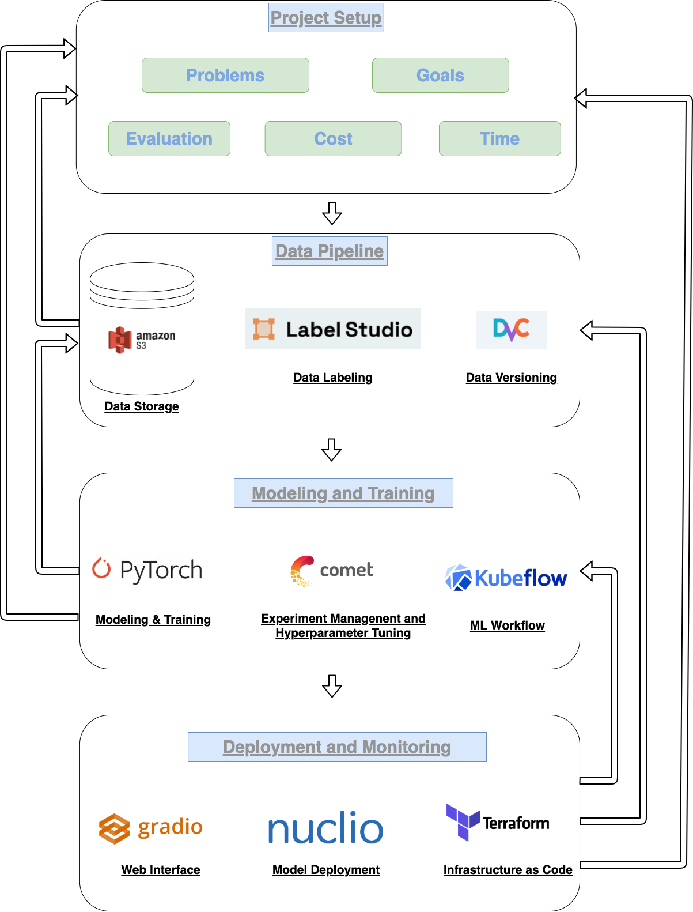

# Tổng quan về một hệ thống học máy
Trí tuệ nhân tạo đang là một trong những lĩnh vực đang được chú trọng phát triển và ứng dụng rất nhiều trong thời gian gần đây, trong mọi lĩnh vực từ nông nghiệp, công nghiệp đến dịch vụ, và nó đã mang lại nhiều lợi ích cho các doanh nghiệp nhằm giúp tối ưu hoá quy trình cũng như cắt giảm chi phí. 

Để ứng dụng được các nghiên cứu về trí tuệ nhân tạo vào thực tế, các kỹ sư cần phải biết cách thiết kế và xây dựng một hệ thống học máy đảm bảo được các yêu cầu về kinh tế cũng như kĩ thuật, nhằm mang lại sản phẩm tối ưu nhất để ứng dụng cho các doanh nghiệp, tổ chức.

## Quy trình của một hệ thống học máy 

### 1. Xây dựng yêu cầu cho hệ thống 
<!-- Mục đích, cách đánh giá, kết quả mong muốn, chi phí và thời gian. -->
Để xây dựng một hệ thống học máy, trước tiên chúng ta cần phải phân tích yêu cầu của hệ thống.

- **Bài toán**: Chúng ta cần xác định vấn đề đặt ra của bài toán mà chúng ta cần giải quyết, mục tiêu của bài toán là gì, có thể là giảm chi phí con người, tăng năng suất lao động bằng cách tự động hoá một phần quy trình hiện tại. 

- **Dữ liệu**: Dữ liệu đầu vào của bài toán là gì? Chúng ta có thể sử dụng những loại dữ liệu nào (hình ảnh, âm thanh, ngôn ngữ, cơ sở dữ liệu) để làm đầu vào cho bài toán cần giải quyết? Số lượng dữ liệu mà chúng ta có hoặc cần có để huấn luyện các mô hình học máy. 

- **Phương pháp đánh giá**: Chúng ta cần đưa ra cách đánh giá cho hệ thống mà chúng ta thiết kế. Cách đánh giá có thể là độ chính xác của mô hình, thời gian xử lý của mô hình. Chúng ta cần phải có một cách đánh giá có thể đo lường được bằng con số cụ thể.

- **Yêu cầu khác**: Ngoài ra chúng ta cần phải xem xét các ràng buộc về thời gian phát triển hệ thống, về tài nguyên mà chúng ta có thể sử dụng để phát triển và triển khai mô hình, ví dụ chúng ta phải triển khai trên mobile thay vì triển khai trên hệ thống có GPU. Tất cả những yêu cầu này cần được xem xét trước khi thực hiện việc xây dựng hệ thống.

### 2. Dữ liệu
<!-- Lưu trữ dữ liệu, gán nhãn dữ liệu, data versioning -->
Dữ liệu mà một thành phần quan trọng và tất nhiên không thể thiếu để xây dựng một hệ thống. Trong thực tế, phần lớn thời gian phát triển hệ thống học máy tập trung vào việc thu thập, phân tích, gán nhãn và làm sạch dữ liệu. Ngoài việc phân loại và thu thập dữ liệu cần có, chúng ta cũng cần phải quan tâm đến một số vấn đề như:
- **Lưu trữ dữ liệu**: chúng ta cần phải tìm hiểu cách mà chúng ta lưu trữ dữ liệu, dữ liệu ở lưu cục bộ, hay lưu đám mây (cloud) hay trực tiếp trên các thiết bị (on-device). Chúng ta cũng cần phải đảm bảo dữ liệu được lưu trữ một cách an toàn.
- **Gán nhãn dữ liệu**: để có một mô hình học máy tốt, chúng ta cần phải đảm bảo dữ liệu được gán nhãn một cách đồng nhất và đảm bảo được chất lượng cũng như thời gian gán nhãn. Ngoài việc tự gán nhãn bằng cách sử dụng nội bộ, chúng ta có thể thuê công ty gán nhãn dữ liệu thực hiện việc này, hoặc sử dụng các nền tảng crowdsource labeling để thực hiện việc gán nhãn dữ liệu.
- **Data Versioning**: để đảm bảo việc phát triển các mô hình học máy, chúng ta cần thực hiện đánh giá các mô hình trên cùng một phiên bản của dữ liệu. Thêm vào đó, dữ liệu cũng có thể được cập nhật liên tục theo thời gian, vì vậy việc đánh nhãn cho các phiên bản dữ liệu là một công việc cần thiết.

### 3. Xây dựng và tối ưu mô hình học máy
<!-- Modeling, Model training, model monitoring/experiment management, Hyperparameter tuning -->

Khi tiếp cận với một bài toán học máy, chúng ta cần phải xem xét và phân loại bài toán này để sử dụng mô hình học máy phù hợp với bài toán. Chúng ta cần phải phân tích các thành phần hoặc các bước cần phải thực hiện để có thể giải quyết bài toán, liệu chúng ta chỉ cần sử dụng một thuật toán/mô hình hay cần phải kết hợp các thuật toán khác nhau. 

- **Lựa chọn mô hình**: Thông thường để bắt đầu giải quyết một bài toán, chúng ta có thể xây dựng các thuật toán đơn giản để đánh giá kết quả và làm `baseline`, sau đó chúng ta có thể dần đi đến những phương pháp phức tạp hơn.
- **Huấn luyện mô hình**: khi huấn luyện các mô hình học máy, chúng ta cần phải quan tâm đến các yếu tố ảnh hưởng đến chất lượng và kết quả của mô hình như chất lượng của dữ liệu, kiến trúc/thuật toán, các siêu tham số mà chúng ta sử dụng. Từ đó chúng ta có thể phân tích và cải thiện kết quả của các mô hình dựa trên các yếu tố này.
- **Quản lý thí nghiệm**: Để có thể huấn luyện các mô hình học máy một cách hiệu quả, chúng ta cần phải quản lý và phân tích các thí nghiệm và kết quả của nó để có đánh giá và tìm phương pháp cải thiện. Chúng ta có thể sử dụng các thư viện để quản lý thí nghiệm như Tensorboard, Cometml, Weights & Bias,...
- **Tối ưu siêu tham số**: Khi huấn luyện các mô hình, đặc biệt là các mô hình học sâu, các siêu tham số (hyper-parameters) có ảnh hưởng rất nhiều đến chất lượng của mô hình. Chúng ta có thể sử dụng các phương pháp và thuật toán để tìm ra siêu tham số tốt nhất ví dụ như: Bayes, grid search, random search,...

### 4. Triển khai mô hình
Sau khi huấn luyện mô hình, chúng ta cần triển khai mô hình này vào thực tế. Có nhiều yêu cầu cũng như môi trường khác nhau mà chúng ta cần phải triển khai tuỳ thuộc vào bài toán như: triển khai trên mobile thông qua các ứng dụng, triển khai mô hình trên nền tảng đám mây và cung cấp API cho người dùng, triển khai trên các máy của khách hàng bằng cách gửi các docker image, hoặc chúng ta cũng có thể triển khai thông qua các extensions, SDK,...

## Hệ thống ví dụ
Ở trong hình quy trình của một hệ thống học máy ở đầu trang, chúng ta có thể lựa chọn các thành phần phù hợp cho từng bước trong quy trình. Trong blog này, chúng ta sẽ sử dụng các thư viện mã nguồn mở có sẵn và được sử dụng nhiều trong thực tế.
1. Lưu trữ dữ liệu: Amazon Simple Storage Service (S3)
2. Gán nhãn dữ liệu: Label Studio
3. Data and Model Versioning: Data Version Control (DVC)
4. Xây dựng và huấn luyện mô hình: Pytorch
5. Quản lý thí nghiệm và tối ưu siêu tham số: Cometml
6. ML Workflows: Kubeflow
7. Giao diện demo: Gradio
8. Triển khai mô hình: Nuclio
9. Xây dựng cơ sở hạ tầng: Terraform
## Tài liệu tham khảo
1. [Machine Learning Systems Design - Chip Huyen](https://github.com/chiphuyen/machine-learning-systems-design)
2. [Full Stack Deep Learning](https://fullstackdeeplearning.com/)