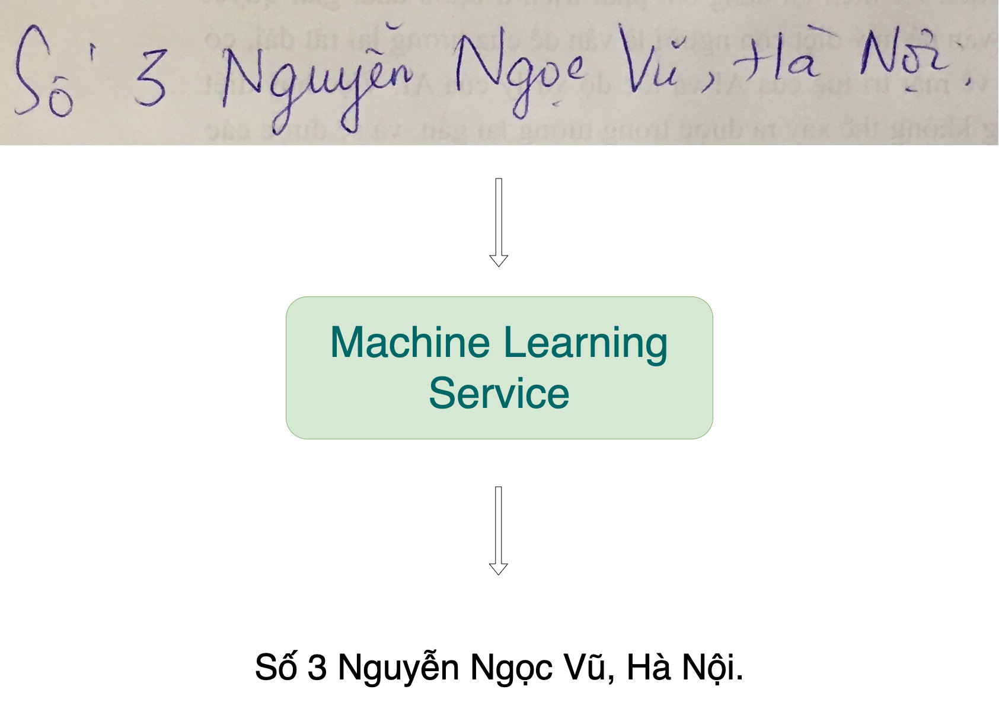
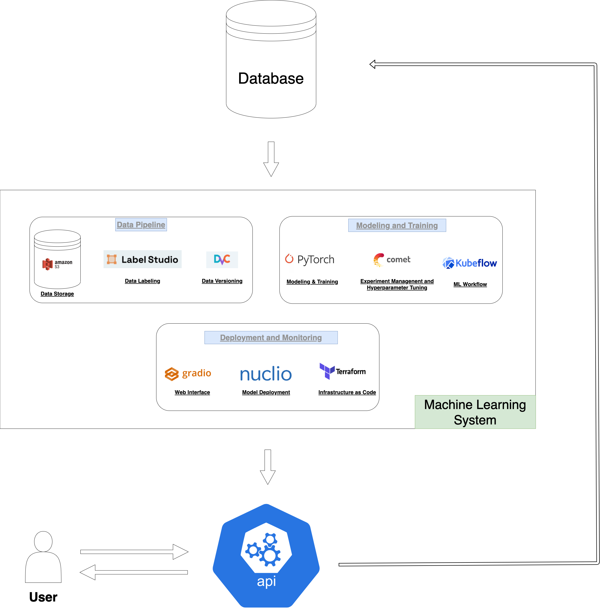

# Bài toán
Trong blog này, chúng ta sẽ xây dựng một hệ thống học máy cho bài toán đọc hình ảnh chữ viết tay.

## Phân tích bài toán

- **Bài toán**: Chuyển đổi hình ảnh chữ viết thành dạng văn bản, ứng dụng trên điện thoại di động, máy tính bảng để người dùng có thể viết thay vì gõ phím.

- **Dữ liệu**: 
    - Bộ dữ liệu hình ảnh chữ viết [CinnamonOCR](https://drive.google.com/drive/folders/1Qa2YA6w6V5MaNV-qxqhsHHoYFRK5JB39)
    - Dữ liệu công khai (public) và dữ liệu tổng hợp (synthetic data)

- **Phương pháp đánh giá**: 
    - Độ chính xác của mô hình > 90%
    - Thời gian dự đoán cho mỗi hình ảnh < 0.1s

- **Yêu cầu khác**:
    - Có thể ứng dụng trực tiếp trên điện thoại hoặc thông qua API

## Thiết kế 

Đây là thiết kế đơn giản cho hệ thống mà chúng ta cần xây dựng. Hệ thống nhận dữ liệu, xử lý và trả về API để người dùng có thể sử dụng. Chúng ta sẽ lưu trữ dữ liệu người dùng vào cơ sở dữ liệu nhằm mục đích cải thiện mô hình trong tương lai.

Bài trước: [Tổng quan về một hệ thống học máy (Machine Learning System)](./overview/index.md)

Bài tiếp theo: [Lưu trữ và gán nhãn dữ liệu](./data/index.md)

[Về Trang chủ](../index.md)