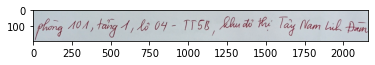
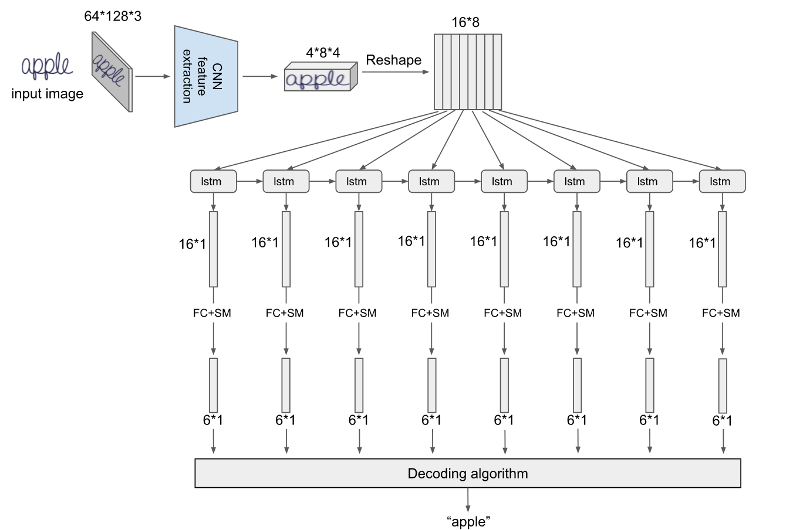
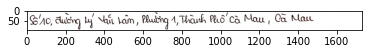
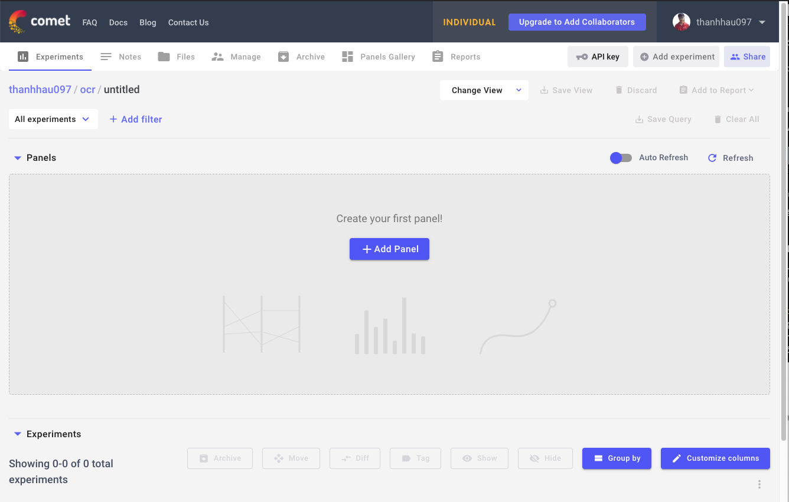
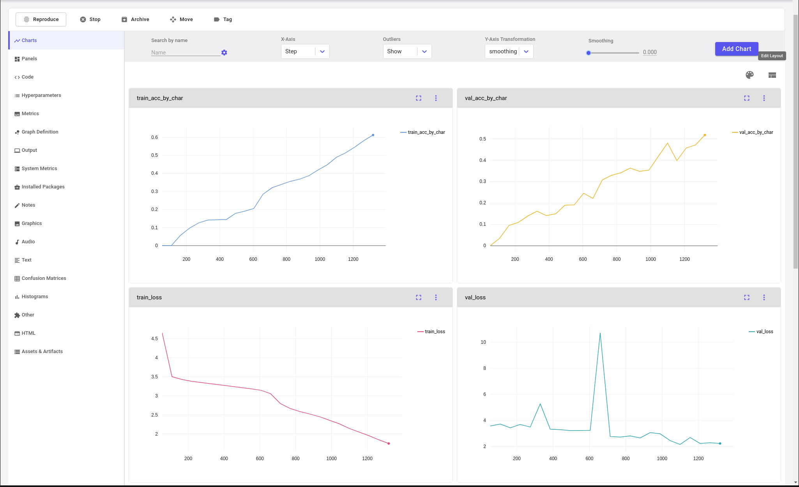

# Huấn luyện mô hình
Sau khi có được dữ liệu thông qua việc gán nhãn, chúng ta sẽ tiến hành xây dựng và huấn luyện mô hình học máy dựa trên dữ liệu này. Trong blog này, chúng ta sẽ sử dụng Pytorch để xây dựng và huấn luyện mô hình, Cometml để quản lý thí nghiệm và tối ưu siêu tham số và DVC để lưu trọng số của mô hình.

## Bài toán
Mục tiêu của bài toán là đọc hình ảnh của một dòng chữ và đưa ra kết quả dòng chữ đó. Ví dụ:

- Đầu vào: 

    

- Kết quả: `phòng 101, tầng 1, lô 04 - TT58, khu đô thị Tây Nam Linh Đàm`

Chúng ta sẽ gọi bài toán này là bài toán `Nhận diện kí tự quang học (Optical Character Recognition - OCR)`
## Các phương pháp/mô hình phổ biến
Có rất nhiều phương pháp, mô hình học máy có thể được sử dụng để giải quyết bài toán OCR, các bạn có thể tìm hiểu thêm ở github này: https://github.com/hwalsuklee/awesome-deep-text-detection-recognition

Trong phần này, chúng ta sẽ nhắc đến hai mô hình phổ biến là nền tảng của các mô hình sau này, đó là `Convolutional Recurrent Neural Network + CTC` và `Convolution Recurrent Neural Network + Attention`. Có nhiều blog/video giải thích các mô hình này một cách rất chi tiết và dễ hiểu, đường dẫn đến các blog này được đặt ở mục tài liệu tham khảo. Ở trong blog này, chúng ta sẽ tập trung vào phần thực hành để hiểu rõ hơn về cơ chế hoạt động và cách cải thiện mô hình.



Trong blog này, chúng ta sẽ sử dụng `CTC decoding` cho `decoding algorithm` và `CTC loss function` để huấn luyện mô hình.

## Xây dựng mô hình học máy với Convolutional Recurrent Neural Network
Trước hết chúng ta cần phải cài đặt các thư viện cần thiết:
```
pip install torch
pip install numpy
pip install opencv-python
```

### Xử lý dữ liệu

LSTM networkSau khi gán nhãn dữ liệu, chúng ta chọn `Export` và chọn định dạng `JSON` để tải nhãn của dữ liệu về máy, dữ liệu đã được gán nhãn có định dạng như sau:

```json
[
  {
    "id": 17,
    "annotations": [
      {
        "id": 17,
        "completed_by": {
          "id": 1,
          "email": "admin@test.com",
          "first_name": "",
          "last_name": ""
        },
        "result": [
          {
            "value": {
              "choices": [
                "Good"
              ]
            },
            "id": "HDtFcMqe2T",
            "from_name": "chc",
            "to_name": "image",
            "type": "choices"
          },
          {
            "value": {
              "text": [
                "Số 253 đường Trần Phú, Thị trấn Nam Sách, Huyện Nam Sách, Hải Dương"
              ]
            },
            "id": "fx_csJL0zD",
            "from_name": "caption",
            "to_name": "image",
            "type": "textarea"
          }
        ],
        "was_cancelled": false,
        "ground_truth": false,
        "created_at": "2021-08-03T04:55:01.906421Z",
        "updated_at": "2021-08-03T04:55:01.906486Z",
        "lead_time": 24.076,
        "prediction": {},
        "result_count": 0,
        "task": 17
      }
    ],
    "predictions": [],
    "data": {
      "captioning": "s3://ocrpipeline/data/train/images/0000_samples.png"
    },
    "meta": {},
    "created_at": "2021-08-02T15:26:42.229399Z",
    "updated_at": "2021-08-02T15:26:42.229500Z",
    "project": 3
  }
]
```


Chúng ta có thể giữ dạng dữ liệu này dùng cho việc huấn luyện mô hình, hoặc có thể chuyển về định dạng đơn giản hơn. Ở đây, chúng ta sẽ chuyển về định dạng mới là một `dictionary` giống với dữ liệu của `CinnamonOCR`, các bạn có thể tìm dữ liệu đã được gán nhãn theo định dạng này ở file `labels.json` ở mỗi thư mục ảnh.


```python
import os
import json
```


```python
def convert_label_studio_format_to_ocr_format(label_studio_json_path, output_path):
    with open(label_studio_json_path, 'r') as f:
        data = json.load(f)
        
    ocr_data = {}
    
    for item in data:
        image_name = os.path.basename(item['data']['captioning'])
        
        text = ''
        for value_item in item['annotations'][0]['result']:
            if value_item['from_name'] == 'caption':
                text = value_item['value']['text'][0]
        ocr_data[image_name] = text
        
    with open(output_path, 'w') as f:
        json.dump(ocr_data, f, indent=4)
    
    print('Successfully converted ', label_studio_json_path)
```


```python
convert_label_studio_format_to_ocr_format('./data/train/label_studio_data.json', './data/train/labels.json')
convert_label_studio_format_to_ocr_format('./data/validation/label_studio_data.json', './data/validation/labels.json')
convert_label_studio_format_to_ocr_format('./data/test/label_studio_data.json', './data/test/labels.json')
```

    Successfully converted  ./data/train/label_studio_data.json
    Successfully converted  ./data/validation/label_studio_data.json
    Successfully converted  ./data/test/label_studio_data.json


### Xây dựng Dataloader

Xây dựng bộ từ điển các kí tự có thể xuất hiện:


```python
CHARACTERS = "aáàạảãăắằẳẵặâấầẩẫậbcdđeéèẹẻẽêếềệểễfghiíìịỉĩjklmnoóòọỏõôốồộổỗơớờợởỡpqrstuúùụủũưứừựửữvxyýỳỷỹỵzwAÁÀẠẢÃĂẮẰẲẴẶÂẤẦẨẪẬBCDĐEÉÈẸẺẼÊẾỀỆỂỄFGHIÍÌỊỈĨJKLMNOÓÒỌỎÕÔỐỒỘỔỖƠỚỜỢỞỠPQRSTUÚÙỤỦŨƯỨỪỰỬỮVXYÝỲỴỶỸZW0123456789 .,-/()'#+:"

PAD_token = 0  # Used for padding short sentences
SOS_token = 1  # Start-of-sentence token
EOS_token = 2  # End-of-sentence token

CHAR2INDEX = {"PAD": PAD_token, "SOS": SOS_token, "EOS": EOS_token}
INDEX2CHAR = {PAD_token: "PAD", SOS_token: "SOS", EOS_token: "EOS"}

for i, c in enumerate(CHARACTERS):
    CHAR2INDEX[c] = i + 3
    INDEX2CHAR[i + 3] = c
```

Chúng ta cần thêm các kí tự đặc biết như `PAD` để thêm vào những chuỗi ngắn hơn trong một `batch`, bởi vì các chuỗi trong một `batch` cần có độ dài bằng nhau. `SOS` và `EOS` là các kí tự để đánh dấu bắt đầu câu và kết thúc câu. Chúng ta cần xây dựng các hàm phụ trợ để chuyển đổi từ chuỗi kí tự thành dữ liệu dạng số và ngược lại.


```python
def get_indices_from_label(label):
    indices = []
    for char in label:
#         if CHAR2INDEX.get(char) is not None:
            indices.append(CHAR2INDEX[char])

    indices.append(EOS_token)
    return indices

def get_label_from_indices(indices):
    label = ""
    for index in indices:
        if index == EOS_token:
            break
        elif index == PAD_token:
            continue
        else:
            label += INDEX2CHAR[index.item()]

    return label
```

Xây dựng OCR dataset dựa trên các kí tự ở trên, chúng ta cần truyền vào đường dẫn của hình ảnh và nhãn của tập dữ liệu tương ứng. Ngoài ra chúng ta có thể truyền các hàm `transform` để thực hiện việc `augment` dữ liệu.


```python
from comet_ml import Experiment

import cv2
from torch.utils.data import Dataset


class OCRDataset(Dataset):
    def __init__(self, data_dir, label_path, transform=None):
        self.data_dir = data_dir
        self.label_path = label_path
        self.transform = transform
        self.image_paths, self.labels = self.get_image_paths_and_labels(label_path)

    def __len__(self):
        return len(self.image_paths)

    def __getitem__(self, idx):
        img_path = self.get_data_path(self.image_paths[idx])
        image = cv2.imread(img_path)
        label = self.labels[idx]
        label = get_indices_from_label(label)
        sample = {"image": image, "label": label}
        return sample

    def get_data_path(self, path):
        return os.path.join(self.data_dir, path)

    def get_image_paths_and_labels(self, json_path):
        with open(json_path, 'r', encoding='utf-8') as f:
            data = json.load(f)

        image_paths = list(data.keys())
        labels = list(data.values())
        return image_paths, labels
```

Xây dựng dataloader: Khi xây dựng dataloader, chúng ta cần có `collate_fn` để gộp các item đơn lẻ lại với nhau. Ở đây, `collate_fn` (collate_wrapper) thực hiện một số chức năng như:
- Đưa các hình ảnh về cùng chiều cao và thêm nhưng khoảng trắng phía sau những hình ảnh có độ rộng ngắn hơn
- Đưa các nhãn về cùng độ dài bằng cách thêm kí tự `PAD` vào những chuỗi ngắn hơn.
- Chuyển dữ liệu về dạng `torch.Tensor`


```python
import itertools

def collate_wrapper(batch):
    """
    Labels are already numbers
    :param batch:
    :return:
    """
    images = []
    labels = []
    # TODO: can change height in config
    height = 64
    max_width = 0
    max_label_length = 0

    for sample in batch:
        image = sample['image']
        try:
            image = process_image(image, height=height, channels=image.shape[2])
        except:
            continue

        if image.shape[1] > max_width:
            max_width = image.shape[1]

        label = sample['label']

        if len(label) > max_label_length:
            max_label_length = len(label)

        images.append(image)
        labels.append(label)

    # PAD IMAGES: convert to tensor with size b x c x h x w (from b x h x w x c)
    channels = images[0].shape[2]
    images = process_batch_images(images, height=height, max_width=max_width, channels=channels)
    images = images.transpose((0, 3, 1, 2))
    images = torch.from_numpy(images).float()

    # LABELS
    pad_list = zero_padding(labels)
    mask = binary_matrix(pad_list)
    mask = torch.ByteTensor(mask)
    labels = torch.LongTensor(pad_list)
    return images, labels, mask, max_label_length


def process_image(image, height=64, channels=3):
    """Converts to self.channels, self.max_height
    # convert channels
    # resize max_height = 64
    """
    shape = image.shape
    # if shape[0] > 64 or shape[0] < 32:  # height
    try:
        image = cv2.resize(image, (int(height/shape[0] * shape[1]), height))
    except:
        return np.zeros([1, 1, channels])
    return image / 255.0


def process_batch_images(images, height, max_width, channels=3):
    """
    Convert a list of images to a tensor (with padding)
    :param images: list of numpy array images
    :param height: desired height
    :param max_width: max width of all images
    :param channels: number of image channels
    :return: a tensor representing images
    """
    output = np.ones([len(images), height, max_width, channels])
    for i, image in enumerate(images):
        final_img = image
        shape = image.shape
        output[i, :shape[0], :shape[1], :] = final_img

    return output


def zero_padding(l, fillvalue=PAD_token):
    """
    Pad value PAD token to l
    :param l: list of sequences need padding
    :param fillvalue: padded value
    :return:
    """
    return list(itertools.zip_longest(*l, fillvalue=fillvalue))


def binary_matrix(l, value=PAD_token):
    m = []
    for i, seq in enumerate(l):
        m.append([])
        for token in seq:
            if token == value:
                m[i].append(0)
            else:
                m[i].append(1)
    return m
```

Sau đó chúng ta sử dụng hàm `collate_fn` này để xây dựng `dataloader`

### Xây dựng mô hình học máy
Trong phần này, chúng ta sẽ xây dựng mô hình học máy CRNN dựa theo hình minh hoạ ở trên. Mô hình của chúng ta gồm 2 thành phần chính: 
- `CNN feature extraction`: là một mạng convolutional neural network để trích xuất các thông tin về hình ảnh.
- `LSTM network`: để trích xuất thông tin dạng chuỗi của chuỗi kí tự

Trong `CNN feature extraction`, chúng ta sử dụng mạng VGG làm `backbone` của mạng, nhận đầu vào là hình ảnh với số kênh là 3, và trả về một tensor có độ sâu là 512


```python
import torch.nn as nn
import torch.nn.functional as F


class VGG_FeatureExtractor(nn.Module):
    """ FeatureExtractor of CRNN (https://arxiv.org/pdf/1507.05717.pdf) """

    def __init__(self, input_channel, output_channel=512):
        super(VGG_FeatureExtractor, self).__init__()
        self.output_channel = [int(output_channel / 8), int(output_channel / 4),
                               int(output_channel / 2), output_channel]  # [64, 128, 256, 512]
        self.ConvNet = nn.Sequential(
            nn.Conv2d(input_channel, self.output_channel[0], 3, 1, 1), nn.ReLU(True),
            nn.MaxPool2d(2, 2),  # 64x16x50
            nn.Conv2d(self.output_channel[0], self.output_channel[1], 3, 1, 1), nn.ReLU(True),
            nn.MaxPool2d(2, 2),  # 128x8x25
            nn.Conv2d(self.output_channel[1], self.output_channel[2], 3, 1, 1), nn.ReLU(True),  # 256x8x25
            nn.Conv2d(self.output_channel[2], self.output_channel[2], 3, 1, 1), nn.ReLU(True),
            nn.MaxPool2d((2, 1), (2, 1)),  # 256x4x25
            nn.Conv2d(self.output_channel[2], self.output_channel[3], 3, 1, 1, bias=False),
            nn.BatchNorm2d(self.output_channel[3]), nn.ReLU(True),  # 512x4x25
            nn.Conv2d(self.output_channel[3], self.output_channel[3], 3, 1, 1, bias=False),
            nn.BatchNorm2d(self.output_channel[3]), nn.ReLU(True),
            nn.MaxPool2d((2, 1), (2, 1)),  # 512x2x25
            nn.Conv2d(self.output_channel[3], self.output_channel[3], 2, 1, 0), nn.ReLU(True))  # 512x1x24

    def forward(self, input):
        return self.ConvNet(input)
```

Trong `LSTM network`, chúng ta sử dụng `GRU cell` giúp cải thiện tốc độ tính toán và cơ chế hai chiều `bidirectional` để giúp mô hình có thể học được thông tin từ cả hai hướng từ trái sang phải và từ phải sang trái.


```python
class BidirectionalGRU(nn.Module):
    def __init__(self, input_size, hidden_size, output_size):
        super(BidirectionalGRU, self).__init__()

        self.rnn = nn.GRU(input_size, hidden_size, bidirectional=True)
        self.embedding = nn.Linear(hidden_size * 2, output_size)

    def forward(self, x):
        recurrent, hidden = self.rnn(x)
        T, b, h = recurrent.size()
        t_rec = recurrent.view(T * b, h)

        output = self.embedding(t_rec)  # [T * b, nOut]
        output = output.view(T, b, -1)

        return output, hidden
```

Kết hợp hai thành phần này lại với nhau, chúng ta có được một mô hình, đặt tên là `CTCModel`, chi tiết như sau:


```python
class CTCModel(nn.Module):
    def __init__(self, inner_dim=512, num_chars=65):
        super().__init__()
        self.encoder = VGG_FeatureExtractor(3, inner_dim)
        self.AdaptiveAvgPool = nn.AdaptiveAvgPool2d((None, 1))
        self.rnn_encoder = BidirectionalGRU(inner_dim, 256, 256)
        self.num_chars = num_chars
        self.decoder = nn.Linear(256, self.num_chars)

    def forward(self, x, labels=None, max_label_length=None, device=None, training=True):
        # ---------------- CNN ENCODER --------------
        x = self.encoder(x)
        # print('After CNN:', x.size())

        # ---------------- CNN TO RNN ----------------
        x = x.permute(3, 0, 1, 2)  # from B x C x H x W -> W x B x C x H
        x = self.AdaptiveAvgPool(x)
        size = x.size()
        x = x.reshape(size[0], size[1], size[2] * size[3])

        # ----------------- RNN ENCODER ---------------
        encoder_outputs, last_hidden = self.rnn_encoder(x)
        # print('After RNN', x.size())

        # --------------- CTC DECODER -------------------
        # batch_size = encoder_outputs.size()[1]
        outputs = self.decoder(encoder_outputs)

        return outputs
```

### Huấn luyện mô hình

Để huấn luyện mô hình, chúng ta cần phải định nghĩa các hàm mất mát và các chỉ số dùng để đánh giá tính hiệu quả của mô hình.

Với hàm mất mát, chúng ta sử dụng `CTC loss function`, các bạn có thể tìm hiểu thêm cách nó hoạt động ở mục tài liệu tham khảo.


```python
import torch
import torch.nn.functional as F
from torch.nn import CTCLoss, CrossEntropyLoss

def ctc_loss(outputs, targets, mask):
    USE_CUDA = torch.cuda.is_available()
    device = torch.device("cuda:0" if USE_CUDA else "cpu")
    target_lengths = torch.sum(mask, dim=0).to(device)
    # We need to change targets, PAD_token = 0 = blank
    # EOS token -> PAD_token
    targets[targets == EOS_token] = PAD_token
    outputs = outputs.log_softmax(2)
    input_lengths = outputs.size()[0] * torch.ones(outputs.size()[1], dtype=torch.int)
    loss_fn = CTCLoss(blank=PAD_token, zero_infinity=True)
    targets = targets.transpose(1, 0)
    # target_lengths have EOS token, we need minus one
    target_lengths = target_lengths - 1
    targets = targets[:, :-1]
    # print(input_lengths, target_lengths)
    torch.backends.cudnn.enabled = False
    # TODO: NAN when target_length > input_length, we can increase size or use zero infinity
    loss = loss_fn(outputs, targets, input_lengths, target_lengths)
    torch.backends.cudnn.enabled = True

    return loss, loss.item()
```

Với chỉ số đánh giá, chúng ta sẽ sử dụng hai chỉ số:
- `Accuracy by char`: dựa trên kí tự dự đoán
- `Accuracy by field`: dựa trên toàn bộ chuỗi, chỉ tính đúng khi toàn bộ chuỗi được dự đoán là đúng.


```python
import difflib

def calculate_ac(str1, str2):
    """Calculate accuracy by char of 2 string"""

    total_letters = len(str1)
    ocr_letters = len(str2)
    if total_letters == 0 and ocr_letters == 0:
        acc_by_char = 1.0
        return acc_by_char
    diff = difflib.SequenceMatcher(None, str1, str2)
    correct_letters = 0
    for block in diff.get_matching_blocks():
        correct_letters = correct_letters + block[2]
    if ocr_letters == 0:
        acc_by_char = 0
    elif correct_letters == 0:
        acc_by_char = 0
    else:
        acc_1 = correct_letters / total_letters
        acc_2 = correct_letters / ocr_letters
        acc_by_char = 2 * (acc_1 * acc_2) / (acc_1 + acc_2)

    return float(acc_by_char)

def accuracy_ctc(outputs, targets):
    outputs = outputs.permute(1, 0, 2)
    targets = targets.transpose(1, 0)

    total_acc_by_char = 0
    total_acc_by_field = 0

    for output, target in zip(outputs, targets):
        out_best = list(torch.argmax(output, -1))  # [2:]
        out_best = [k for k, g in itertools.groupby(out_best)]
        pred_text = get_label_from_indices(out_best)
        target_text = get_label_from_indices(target)

        # print('predict:', pred_text, 'target:', target_text)

        acc_by_char = calculate_ac(pred_text, target_text)
        total_acc_by_char += acc_by_char

        if pred_text == target_text:
            total_acc_by_field += 1

    return np.array([total_acc_by_char / targets.size()[0], total_acc_by_field / targets.size()[0]])

```

Chúng ta khởi tạo `dataloader` cho việc huấn luyện mô hình như sau:


```python
from torch.utils.data import DataLoader

BATCH_SIZE = 32
NUM_WORKERS = 4

train_dataset = OCRDataset(data_dir='./data/train/images/', label_path='./data/train/labels.json')
val_dataset = OCRDataset(data_dir='./data/validation/images/', label_path='./data/validation/labels.json')

train_dataloader = DataLoader(train_dataset, batch_size=BATCH_SIZE, num_workers=NUM_WORKERS, collate_fn=collate_wrapper)
val_dataloader = DataLoader(val_dataset, batch_size=BATCH_SIZE, num_workers=NUM_WORKERS, collate_fn=collate_wrapper)
```

Và khởi tạo mô hình học máy:


```python
model = CTCModel(inner_dim=128, num_chars=len(CHAR2INDEX))
```


```python
model
```


>     CTCModel(
>       (encoder): VGG_FeatureExtractor(
>         (ConvNet): Sequential(
>           (0): Conv2d(3, 16, kernel_size=(3, 3), stride=(1, 1), padding=(1, 1))
>           (1): ReLU(inplace=True)
>           (2): MaxPool2d(kernel_size=2, stride=2, padding=0, dilation=1, ceil_mode=False)
>           (3): Conv2d(16, 32, kernel_size=(3, 3), stride=(1, 1), padding=(1, 1))
>           (4): ReLU(inplace=True)
>           (5): MaxPool2d(kernel_size=2, stride=2, padding=0, dilation=1, ceil_mode=False)
>           (6): Conv2d(32, 64, kernel_size=(3, 3), stride=(1, 1), padding=(1, 1))
>           (7): ReLU(inplace=True)
>           (8): Conv2d(64, 64, kernel_size=(3, 3), stride=(1, 1), padding=(1, 1))
>           (9): ReLU(inplace=True)
>           (10): MaxPool2d(kernel_size=(2, 1), stride=(2, 1), padding=0, dilation=1, ceil_mode=False)
>           (11): Conv2d(64, 128, kernel_size=(3, 3), stride=(1, 1), padding=(1, 1), bias=False)
>           (12): BatchNorm2d(128, eps=1e-05, momentum=0.1, affine=True, track_running_stats=True)
>           (13): ReLU(inplace=True)
>           (14): Conv2d(128, 128, kernel_size=(3, 3), stride=(1, 1), padding=(1, 1), bias=False)
>           (15): BatchNorm2d(128, eps=1e-05, momentum=0.1, affine=True, track_running_stats=True)
>           (16): ReLU(inplace=True)
>           (17): MaxPool2d(kernel_size=(2, 1), stride=(2, 1), padding=0, dilation=1, ceil_mode=False)
>           (18): Conv2d(128, 128, kernel_size=(2, 2), stride=(1, 1))
>           (19): ReLU(inplace=True)
>         )
>       )
>       (AdaptiveAvgPool): AdaptiveAvgPool2d(output_size=(None, 1))
>       (rnn_encoder): BidirectionalGRU(
>         (rnn): GRU(128, 256, bidirectional=True)
>         (embedding): Linear(in_features=512, out_features=256, bias=True)
>       )
>       (decoder): Linear(in_features=256, out_features=210, bias=True)
>     )


Định nghĩa các thông số cần thiết:
- N_EPOCHS: số lần lặp lại dữ liệu để huấn luyện mô hình
- optimizer: phương pháp tối ưu mô hình
- loss_fn: hàm mất mát
- metric_fn: hàm để đánh giá hiệu quả của mô hình
- device: huấn luyện mô hình trên thiết bị `cpu` hay `gpu`


```python
import torch
import numpy as np

N_EPOCHS = 50
optimizer = torch.optim.Adam(model.parameters())
loss_fn = ctc_loss
metric_fn = accuracy_ctc
device = 'cpu' if not torch.cuda.is_available() else 'cuda'
```

Huấn luyện mô hình trong 1 epoch được thực hiện như sau:


```python
def train_epoch(epoch):
    model.train()
    total_loss = 0
    total_metrics = np.zeros(2)
    for batch_idx, (images, labels, mask, max_label_length) in enumerate(train_dataloader):
        images, labels, mask = images.to(device), labels.to(device), mask.to(device)

        optimizer.zero_grad()
        output = model(images, labels, max_label_length, device)

        loss, print_loss = loss_fn(output, labels, mask)
        loss.backward()
        optimizer.step()

        total_loss += print_loss  # loss.item()
        total_metrics += metric_fn(output, labels)

        if batch_idx == len(train_dataloader):
            break

    log = {
        'loss': total_loss / len(train_dataloader),
        'metrics': (total_metrics / len(train_dataloader)).tolist()
    }

    return log
```

Và đánh giá mô hình sau mỗi epoch:


```python
def val_epoch():
    # when evaluating, we don't use teacher forcing
    model.eval()
    total_val_loss = 0
    # total_val_metrics = np.zeros(len(self.metrics))
    total_val_metrics = np.zeros(2)
    with torch.no_grad():
        # print("Length of validation:", len(self.valid_data_loader))
        for batch_idx, (images, labels, mask, max_label_length) in enumerate(val_dataloader):
            images, labels, mask = images.to(device), labels.to(device), mask.to(device)
            images, labels, mask = images.to(device), labels.to(device), mask.to(device)

            output = model(images, labels, max_label_length, device, training=False)
            _, print_loss = loss_fn(output, labels, mask)  # Attention:
            # loss = self.loss(output, labels, mask)
            # print_loss = loss.item()

            total_val_loss += print_loss
            total_val_metrics += metric_fn(output, labels)

    return_value = {
        'loss': total_val_loss / len(val_dataloader),
        'metrics': (total_val_metrics / len(val_dataloader)).tolist()
    }

    return return_value
```

Chúng ta sẽ huấn luyện mô hình trong `N_EPOCHS` và lưu lại kết quả tốt nhất:


```python
def train():
    best_val_loss = np.inf
    for epoch in range(N_EPOCHS):
        train_log = train_epoch(epoch)
        val_log = val_epoch()
        if val_log['loss'] < best_val_loss:
            # save model
            best_val_loss = val_log['loss']
            torch.save(model.state_dict(), 'best_model.pth')

        if (epoch + 1) % 5 == 0:
            print("Epoch", epoch + 1)
            print("Training log:", train_log)
            print("Validation log:", val_log)

model = model.to(device)      
train()
```

>     Epoch 5
>     Training log: {'loss': 3.3025089090520687, 'metrics': [0.14659446106811722, 0.0]}
>     Validation log: {'loss': 3.416637056752255, 'metrics': [0.16560045738213602, 0.0]}
>     Epoch 10
>     Training log: {'loss': 1.7547788468274204, 'metrics': [0.5980111773906229, 0.0]}
>     Validation log: {'loss': 3.7502923262746712, 'metrics': [0.27276395007704896, 0.0]}
>     Epoch 15
>     Training log: {'loss': 0.9382512699473988, 'metrics': [0.7987094508609432, 0.0]}
>     Validation log: {'loss': 1.1770769294939543, 'metrics': [0.7511817872619981, 0.0]}
>     Epoch 20
>     Training log: {'loss': 0.6035220243714072, 'metrics': [0.8693043548266096, 0.003409090909090909]}
>     Validation log: {'loss': 1.0168936660415249, 'metrics': [0.7848459277694243, 0.0]}
>     Epoch 25
>     Training log: {'loss': 0.38259893493218855, 'metrics': [0.9168481876647544, 0.026136363636363635]}
>     Validation log: {'loss': 2.3598944450679578, 'metrics': [0.687874780974538, 0.0]}
>     Epoch 30
>     Training log: {'loss': 0.2684195746075023, 'metrics': [0.9406091565435668, 0.05777972027972028]}
>     Validation log: {'loss': 1.6666406894984997, 'metrics': [0.7451734024494661, 0.0]}
>     Epoch 35
>     Training log: {'loss': 0.19241986789486626, 'metrics': [0.9572576912350058, 0.11162587412587412]}
>     Validation log: {'loss': 1.4961954229756405, 'metrics': [0.7395299244534455, 0.0]}
>     Epoch 40
>     Training log: {'loss': 0.13954399499026213, 'metrics': [0.9696559504747236, 0.1910839160839161]}
>     Validation log: {'loss': 0.32535767712091146, 'metrics': [0.9302368830633553, 0.03782894736842105]}
>     Epoch 45
>     Training log: {'loss': 0.09284963634881106, 'metrics': [0.9798440719613576, 0.3003059440559441]}
>     Validation log: {'loss': 0.29168694662420375, 'metrics': [0.935447053481159, 0.05098684210526316]}
>     Epoch 50
>     Training log: {'loss': 0.056186766787008804, 'metrics': [0.9883436321086309, 0.47718531468531467]}
>     Validation log: {'loss': 0.4874882886284276, 'metrics': [0.9058548327889324, 0.023026315789473683]}


Chúng ta có thể thấy rằng, mô hình học máy có hội tụ và độ chính xác dựa trên kí tự tương đối cao, nhưng độ chính xác với toàn bộ dòng chữ vẫn còn thấp. Lý do ở đây có thể do số lượng dữ liệu tương đối ít và có thể đến sự đơn giản của mô hình học máy, chúng ta có thể cải thiện mô hình bằng cách `augment` dữ liệu và sử dụng dữ liệu tổng hợp để có được lượng dữ liệu đa dạng hơn. Chúng ta sẽ cải thiện kết quả của mô hình ở phần sau của blog.

### Thử nghiệm dự đoán của mô hình
Sau khi huấn luyện mô hình, chúng ta sẽ thử nghiệm dự đoán độ chính xác của mô hình trên một số hình ảnh mẫu.


```python
def predict(image):
    model.eval()
    batch = [{'image': image, 'label': [1]}]
    images = collate_wrapper(batch)[0]

    images = images.to(device)

    outputs = model(images)
    outputs = outputs.permute(1, 0, 2)
    output = outputs[0]

    out_best = list(torch.argmax(output, -1))  # [2:]
    out_best = [k for k, g in itertools.groupby(out_best)]
    pred_text = get_label_from_indices(out_best)

    return pred_text
```


```python
from matplotlib import pyplot as plt
image = cv2.imread('./data/test/images/0000_tests.png')
plt.imshow(image)
predict(image)
```


>     'Số 10, đường Lý Văn TLâm, Phường 1, Thành Phố Gà Mau, Cà Mau'


    
> 
    


## Quản lý thí nghiệm

Trong phần này, chúng ta sẽ sử dụng công cụ `Cometml`.
`Cometml` cho phép người dùng có thể theo dõi, so sánh, giải thích và tối ưu các thí nghiệm và mô hình từ huấn luyện cho đến triển khai mô hình. Các bạn có thể tìm hiểu thêm về Cometml ở đây: https://www.comet.ml/site/

Chúng ta cần đăng kí tài khoản và cài đặt thư viện `cometml`:
```
pip install comet_ml
```

Sau khi đăng kí tài khoản, chúng ta đăng nhập và tạo dự án mới với tên là `OCR`. Để có thể tương tác với Cometml, chúng ta cần có `API Key` của dự án tương ứng. Chọn `API Key` ở góc trên bên phải của giao diện dự án, chúng ta sẽ có được `API Key` cho dự án này.




```python
# Create an experiment with your api key
experiment = Experiment(
    api_key="73D2HIvmnZARKIEVq7QsQSt8b",
    project_name="ocr",
    workspace="thanhhau097",
)
```

Chúng ta cần quan sát các chỉ số như hàm mất mất, chỉ số đánh giá. Để tải lên `Cometml` những chỉ số này, chúng ta cần chỉnh sửa hàm huấn luyện mô hình như sau:


```python
def train():
    best_val_loss = np.inf
    for epoch in range(N_EPOCHS):
        print("Epoch", epoch + 1)
        train_log = train_epoch(epoch)
        print("Training log:", train_log)
        train_loss = train_log['loss']
        train_acc_by_char = train_log['metrics'][0]
        train_acc_by_field = train_log['metrics'][1]
        experiment.log_metrics({
            "train_loss": train_loss,
            "train_acc_by_char": train_acc_by_char,
            "train_acc_by_field": train_acc_by_field
        }, epoch=epoch)
        
        val_log = val_epoch()
        val_loss = val_log['loss']
        val_acc_by_char = val_log['metrics'][0]
        val_acc_by_field = val_log['metrics'][1]
        experiment.log_metrics({
            "val_loss": val_loss,
            "val_acc_by_char": val_acc_by_char,
            "val_acc_by_field": val_acc_by_field
        }, epoch=epoch)
        if val_log['loss'] < best_val_loss:
            # save model
            best_val_loss = val_log['loss']
            
        print("Validation log:", val_log)

    
def weight_reset(m):
    if isinstance(m, nn.Conv2d) or isinstance(m, nn.Linear):
        m.reset_parameters()
        
model.apply(weight_reset)
train()
```

Chúng ta sẽ quan sát một số thông số như hàm mất mát, độ chính xác. Sau khi huấn luyện mô hình, chúng ta có biểu đồ như sau trên giao diện của dự án trên `Cometml`:



Chúng ta sẽ phân tích hiệu năng của mô hình một cách dễ dàng hơn bằng cách sử dụng các biểu đồ này. Ngoài ra, chúng ta cũng có thể so sánh các thử nghiệm với nhau để phân tích hiệu năng của các lần chạy khác nhau, phân tích sự ảnh hưởng của kiến trúc mô hình cũng như các siêu tham số đến kết quả của việc huấn luyện mô hình.

## Tối ưu siêu tham số

Tối ưu siêu tham số là một công việc cần có sự kinh nghiệm để lựa chọn siêu tham số phù hợp. Có nhiều siêu tham số có thể được tối ưu trong quá trình huấn luyện một mô hình học máy, có thể kể đến như: learning rate, batch size, số lượng layer trong mô hình,...

Ở đây chúng ta sẽ tối ưu số  kênh của `output tensor` của mô hình CNN, được đặt tên là `inner_dim`. Chúng ta sẽ sử dụng thư viên Cometml để tối ưu và tìm ra `inner_dim` tốt cho bài toán của mình.


```python
from comet_ml import Optimizer
# The optimization config:

config = {
    "algorithm": "bayes",
    "spec": {"maxCombo": 10, "objective": "minimize", "metric": "val_loss"},
    "parameters": {
         "inner_dim": {"type": "discrete", "values": [32, 64, 128, 256, 512]},
    },
    "trials": 1,
    "name": "My Optimizer Name",
}


opt = Optimizer(config, api_key='73D2HIvmnZARKIEVq7QsQSt8b')
```


```python
def train(experiment):
    best_val_loss = np.inf
    for epoch in range(N_EPOCHS):
        print("Epoch", epoch + 1)
        train_log = train_epoch(epoch)
        print("Training log:", train_log)
        train_loss = train_log['loss']
        train_acc_by_char = train_log['metrics'][0]
        train_acc_by_field = train_log['metrics'][1]
        experiment.log_metrics({
            "train_loss": train_loss,
            "train_acc_by_char": train_acc_by_char,
            "train_acc_by_field": train_acc_by_field
        }, epoch=epoch)
        
        val_log = val_epoch()
        val_loss = val_log['loss']
        val_acc_by_char = val_log['metrics'][0]
        val_acc_by_field = val_log['metrics'][1]
        experiment.log_metrics({
            "val_loss": val_loss,
            "val_acc_by_char": val_acc_by_char,
            "val_acc_by_field": val_acc_by_field
        }, epoch=epoch)
        if val_log['loss'] < best_val_loss:
            # save model
            best_val_loss = val_log['loss']
            
        print("Validation log:", val_log)


N_EPOCHS = 20
for experiment in opt.get_experiments(project_name="ocr"):
    # Log parameters, or others:
    experiment.log_parameter("epochs", 10)

    # Build the model:
    model = CTCModel(inner_dim=experiment.get_parameter('inner_dim'))
    model = model.to(device)
    optimizer = torch.optim.Adam(model.parameters())

    # Train it:
    train(experiment)

    # Optionally, end the experiment:
    experiment.end()
```


Sau khi huấn luyện mô hình, chúng ta có thể so sánh các thí nghiệm với nhau và tìm ra `inner_dim` tốt nhất cho mô hình. Trên đây chỉ là một ví dụ về việc lựa chọn `inner_dim`, ngoài ra chúng ta cũng có thể tối ưu các siêu tham số khác như `learning rate`, `batch size`,...

<!--  -->

## Model Versioning
Sau khi huấn luyện mô hình, chúng ta cần lưu trọng số của mô hình tốt nhất mà chúng ta có được nhằm phục vụ việc triển khai mô hình sau này. Ngoài ra chúng ta cũng cần lưu trữ mô hình một cách hiệu quả để có thể chia sẻ trọng số của mô hình một cách dễ dàng cũng như có thể tái hiện lại kết quả của thí nghiệm trong trường hợp cần thiết.

Chúng ta sẽ sử dụng Data Version Control (DVC) để lưu trữ trọng số của mô hình lên AWS S3.

Trước tiên chúng ta cần cài đặt `dvc`:
```
pip install dvc
```

Để có thể sử dụng `dvc`, chúng ta cần sử dụng cùng với `git`. Vì vậy chúng ta sẽ cần phải khởi tạo `git` và `dvc`:
```
git init
dvc init
```

Chúng ta sẽ lưu trữ mô hình trên AWS S3. Để cài đặt thư mục lưu trữ, chúng ta làm như sau:
```
dvc remote add -d storage s3://ocrpipeline/weights
```

Sau đó chúng ta sẽ lưu trữ mô hình tốt nhất mà chúng ta đã huấn luyện lên AWS S3:
```
dvc add best_model.pth
dvc push
```

Sau khi lưu trọng số của mô hình bằng `dvc`, chúng ta sẽ có một tệp mới với lên `best_model.pth.dvc`. Chúng ta sẽ lưu trữ tệp này lên `git repository` thay vì phải lưu toàn bộ trọng số của mô hình bằng `git`.
## Tổng kết
Trong phần này, chúng ta đã cùng nhau xây dựng, tối ưu mô hình và lưu trữ mô hình sử dụng các công cụ Pytorch, Cometml và DVC. Trong phần tiếp theo, chúng ta cùng nhau triển khai và ứng dụng mô hình sử dụng kết quả mà chúng ta có được ở phần này.

Bài tiếp theo: [Triển khai và áp dụng mô hình học máy](../deployment/index.md)
## Tài liệu tham khảo
1. [An Intuitive Explanation of Connectionist Temporal Classification](https://towardsdatascience.com/intuitively-understanding-connectionist-temporal-classification-3797e43a86c)
2. [How to build end-to-end recognition system](https://www.youtube.com/watch?v=uVbOckyUemo)